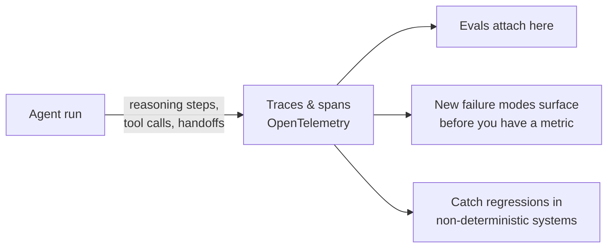

# Agent Observability

The platform layer that **records what an agent actually did** — every reasoning
step, tool call, input, and handoff — as **traces and spans** you can inspect
after the fact.

It matters **more** than in traditional software because the system is
**non-deterministic**: the execution path changes with every run, so you *can't
reason about behavior from the code alone*. Dat Ngo (Arize): *"Your agent called
tool B before tool A, and B has a dependency on A. You did not catch it because
nothing in your code audits agents. The telemetry does."* The emerging standard
is **OpenTelemetry**, keeping instrumentation portable across whatever harness,
model, or framework a team uses.

## The substrate evals attach to

Traces are where [evals](evals-llm-as-a-judge.md) attach, and where new failure
modes surface **before** you have a metric for them. It also catches the
regression trap of non-deterministic systems — *"fix the thing you thought you
fixed, you might have produced two or three regressions you didn't know about."*

## Why it matters: governance, not debugging

When humans stop reviewing every line — the [dark factory](dark-factory.md) end
state — **traceability becomes the control that replaces review.** Every action
logged and attributable to a human-defined intent is what makes autonomy
**auditable**, and what lets regulated industries adopt agents at all.

Observability here isn't a debugging nicety; it's the **governance layer of the
whole platform**.

## Related

- [Evals & LLM-as-a-Judge](evals-llm-as-a-judge.md) — traces are the substrate
  evals sit on.
- [Dark Factory](dark-factory.md) — traceability replaces line-by-line review.
- [Six Layers for AI Governance](six-layers-ai-governance.md) /
  [AI Governance by Design](ai-governance-by-design.md) — the governance frame.

## References
- [Agent Observability — Tessl Patterns](https://tessl.io/patterns/agentic-platform/agent-observability/)
