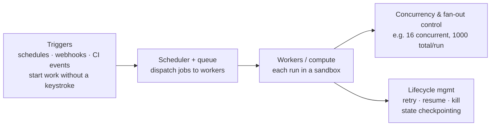

# Agent Runtime

The **managed execution substrate where agents actually run** — especially
unattended. The **platform counterpart to [loop engineering](loop-engineering.md)**:
the *practice* designs a loop; the *runtime* runs loops for everyone. Think
**CI/CD runner farm, but for agents.** *"Codex runs coding tasks in cloud
sandboxes, in parallel, off in the background, and comes back with pull
requests."*

## What it provides

- **Triggers** — start work without a keystroke (schedules, webhooks, CI events).
- **Scheduler + queue** — dispatch jobs to workers.
- **Compute** — executes each run, each dropped into a
  [sandbox](execution-sandboxing.md).
- **Concurrency / fan-out control.**
- **Lifecycle management** — retry, resume, kill, and state checkpointing so a
  long run survives a restart.

Instances: Codex cloud tasks, Cursor background agents, LangChain's Open SWE.

## Why it matters

**"Run unattended loops" has no home without a runtime** — something has to
decide *what* runs, *when*, *where*, *how many*, and what to do when a run fails.
**Caps matter for cost as much as safety** — production systems bound fan-out
(e.g. **16 concurrent, 1,000 total** agents per run). The runtime is the
substrate that turns *"let it run overnight"* into something **operable**.

## Related

- [Loop Engineering](loop-engineering.md) — the practice; the runtime is where
  it executes at scale.
- [Execution Sandboxing](execution-sandboxing.md) — each run lands in a sandbox.
- [Dark Factory](dark-factory.md) — the runtime is the factory floor.

## References
- [Agent Runtime — Tessl Patterns](https://tessl.io/patterns/agentic-platform/agent-runtime/)
