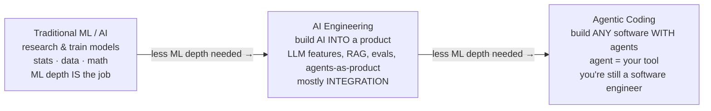

# Agentic Coding vs AI Engineering

Three roles get collapsed into one **"AI" buzzword** and constantly conflated.
They sit on a spectrum from **deep machine learning** to **plain software
development:**

- **Traditional ML / AI** — researching and training models: statistics, data,
  math. Deep ML knowledge *is* the job.
- **AI engineering** — building AI *into* a product: LLM features, RAG,
  evaluation, agents-as-product. Mostly **integration** — wiring models,
  retrieval, tools, evals together. (The role Swyx named in 2023.)
- **Agentic coding** — ordinary software development *with* AI agents. You build
  *any* software; the agent is your tool, and you're still a software engineer
  whose toolchain changed.

**The first two are *domains of work*; the third is a *way of working*.** They
sit in that order for a reason: foundation models and APIs **abstracted the hard
ML parts**, so the further right you move, the less ML depth the day-to-day
needs. Work that once *"took five years and a research team"* now needs *"API
docs and a spare afternoon"* (Swyx). Karpathy: LLMs created a new layer of
abstraction and profession — *"significantly more AI Engineers than ML
engineers."*

## ML fundamentals: good to have, not the main thing

- **AI engineering** — understanding ML helps, but the job is *integration*,
  combining things rather than training them.
- **Agentic coding** — knowing embeddings, RAG, and prompt engineering helps you
  reason about *why* an agent misbehaves — but it's not the focus. The focus is
  **software and domain expertise**, agent as tool.

**Data behind it:** across ~400,000 Claude Code sessions, people made ~**70% of
planning** decisions (what to build), the agent ~**80% of execution** decisions
(how) — and **domain expertise, not coding proficiency, drove success**:
non-engineers reached verified success within a few points of software
engineers.

## Why it matters — mostly for hiring

Conflating the three muddies hiring, learning, and team design — a job ad for an
"AI engineer" can mean any of them. Don't gate the work behind deep ML
credentials:

- **AI engineering → hire integrators:** API fluency, systems thinking, a feel
  for what "good output" looks like. By 2025 the field shifted from vector
  databases to **evals** — the question is no longer "can AI code?" but "how do
  we know the output is good?" (See [evals](evals-llm-as-a-judge.md).)
- **Agentic coding → hire engineers and domain experts;** treat ML depth as a
  bonus, not a prerequisite.

Most of the Tessl patterns (and most HAL notes ingested from them) are about
**agentic coding** — working with agents to build software — not AI engineering
or ML, even as the skill sets increasingly overlap.

## Related

- [Layers of AI](layers-of-ai.md) — the technique taxonomy underneath these
  roles.
- [The AI Learning Ladder](ai-learning-ladder.md) — the skills roadmap across
  the spectrum.
- [Five Engineering Archetypes](five-engineering-archetypes.md) — how the
  agentic-coding role subdivides.

## References
- [Agentic Coding vs AI Engineering — Tessl Patterns](https://tessl.io/patterns/changing-roles/agentic-coding-vs-ai-engineering/)
