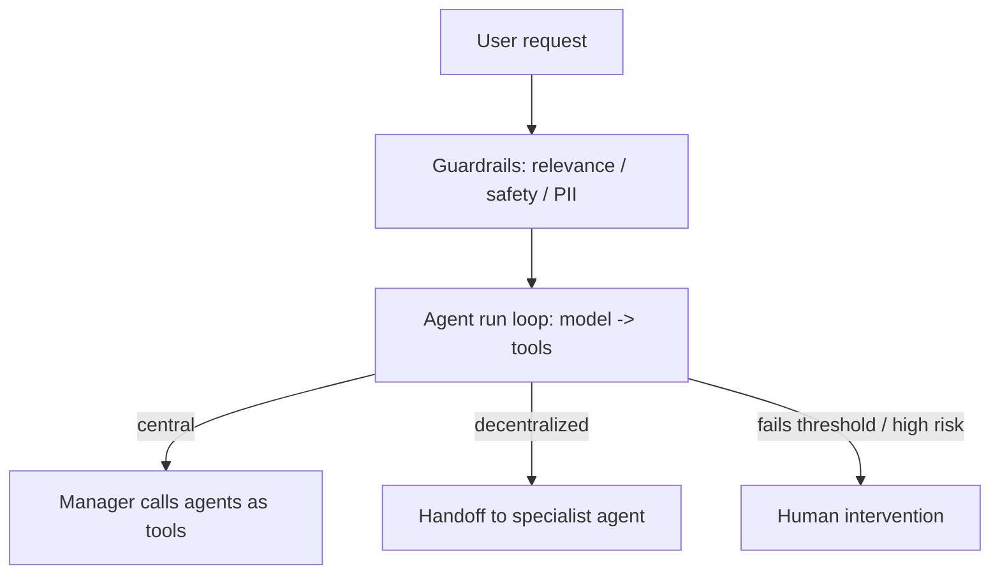

# A Practical Guide to Building Agents (OpenAI)

OpenAI's practitioner guide for product and engineering teams. It defines what an agent
is, when it's worth building one, the three components every agent has, how to orchestrate
them, and how to guard them. Code examples use OpenAI's Agents SDK but the concepts are
framework-agnostic.

## What an agent is — and isn't

> Agents are systems that independently accomplish tasks on your behalf.

An agent uses an LLM to *manage workflow execution and make decisions*, and can call tools
to act. LLM apps that don't control workflow execution — simple chatbots, single-turn
completions, sentiment classifiers — are **not** agents.

## When to build one

Reserve agents for workflows that resisted traditional automation:

- **Complex decision-making** — nuanced judgment, exceptions, context-sensitive calls
  (e.g. refund approval).
- **Difficult-to-maintain rules** — rulesets that have grown unwieldy and error-prone to
  update (e.g. vendor security reviews).
- **Heavy reliance on unstructured data** — interpreting natural language, extracting from
  documents, conversational interaction.

If the workflow is a clean deterministic ruleset, don't reach for an agent.

## The three components

1. **Model** — the LLM doing the reasoning. Start with the most capable model to establish
   a baseline, then swap down to cheaper/faster models where evals show it's safe.
2. **Tools** — external functions/APIs the agent calls to take action.
3. **Instructions** — explicit guidelines and guardrails for behavior.

## Orchestration — start single, grow deliberately

An incremental approach beats jumping to a complex autonomous architecture.

- **Single-agent systems** — one model in a *run loop* (call model → run tools → repeat
  until an exit condition). Add capability by adding tools, keeping evaluation and
  maintenance simple. Manage prompt sprawl with a flexible base **prompt template** that
  takes policy variables, rather than many bespoke prompts. Only graduate to multi-agent
  when a single agent gets unwieldy.
- **Multi-agent — manager pattern (centralized).** A manager agent calls specialized
  agents *as tools* and synthesizes their outputs; control stays in one place. Good when
  you need a single coherent response.
- **Multi-agent — decentralized pattern (handoffs).** Agents on equal footing; a handoff
  is a one-way transfer (implemented as a tool) that passes the conversation state to
  another agent, which then takes over. Good when no central synthesis is needed — e.g. a
  triage agent routing to specialist agents.

## Guardrails — layered defense

No single guardrail is enough; stack specialized ones and pair them with real auth,
access controls, and standard software security. Types the guide names:

- **Relevance classifier** — flags off-topic queries.
- **Safety classifier** — detects jailbreaks / prompt injections.
- **PII filter** — vets output to prevent leaking personal data.
- Plus moderation, tool-risk ratings, output validation, and rules-based protections.

**Human intervention** is the critical safeguard, especially early in deployment: let the
agent gracefully hand control to a human when it exceeds a **failure/retry threshold** or
is about to take a **high-risk action**.

## Related notes

- [Building effective agents](building-effective-agents.md)
- [Agent patterns quick reference](agent-patterns-quick-reference.md)
- [OpenAI Swarm](openai-swarm.md)
- [Guardrails proxy](../ai-platform/guardrails-proxy.md)
- [From coder to orchestrator](../ai-org/from-coder-to-orchestrator.md)

## References

- [A practical guide to building agents](https://openai.com/business/guides-and-resources/a-practical-guide-to-building-ai-agents/)
