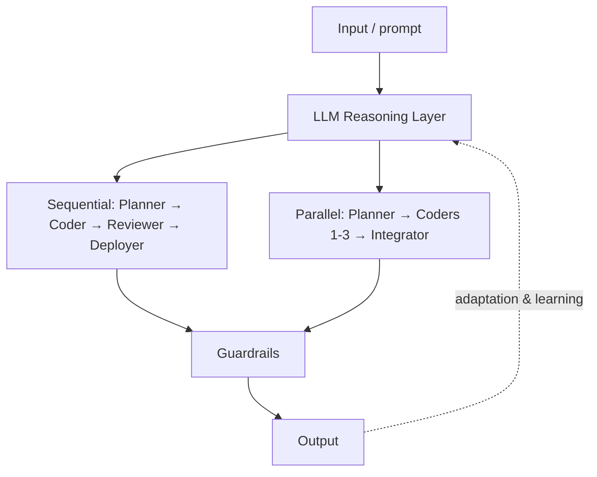

# Agentic Engineering: Sequential and Parallel Agent Core

A block diagram of a multi-agent system. Input/prompt enters through an **LLM Reasoning
Layer** into the **Agentic Engineering Core**, which runs two workflow shapes:

- **Sequential workflow:** Planner → Coder → Reviewer → Deployer agents, one after
  another.
- **Parallel workflow:** a Planner Agent fans work out to Coder Agents 1–3, whose
  results an **Integrator Agent** merges.

A vertical **Guardrails** bar sits between the core and the output, gating everything
that reaches the user. Underneath run two cross-cutting layers: a **Context Layer** and
**Observability & Analytics**. A dotted **Adaptation & Learning** loop feeds output back
in.

The pattern shows both orchestration styles and where guardrails, context, and
observability attach.

## The core

## Cross-links

A concrete instance of the [Agentic Engineering Stack](agentic-engineering-stack.md)
(orchestration + guardrails + context + observability) and the five layers of
[Agent Harness Engineering](../harness-engineering/agent-harness-engineering.md). Sequential vs parallel echoes
the workflow/skill nesting in [The Double Dovetail](../harness-engineering/double-dovetail.md).
