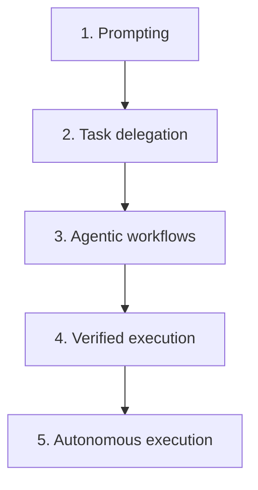

# Agentic Programming: From Prompts to Production (Wilkerson)

A Leanpub book by **Jerod W. Wilkerson** — Professor and Associate Chair of Computer
Science at Brigham Young University — subtitled *A Path to AI Fluency*. Its thesis is
that the important shift is not that AI writes code faster but that it changes *what a
developer can delegate*. The book is a roadmap for the transition from writing software
directly to designing, guiding, verifying, and eventually orchestrating systems that
create it.

## The AI Fluency Ladder

The organizing idea is a five-level ladder of delegation:

For each rung the book argues that a *new bottleneck* appears, and that the developer's
role changes as you climb. This maps closely onto the
[autonomy ladder](../harness-engineering/autonomy-ladder.md) framing used elsewhere in
the wiki, and to the recurring "feedback is the new bottleneck" theme in
[harness engineering](../harness-engineering/harness-engineering.md).

## Structure

- **First half — foundations.** How AI systems actually behave, the mental models
  agentic programming depends on, and the failure modes of probabilistic systems.
- **Second half — hands-on.** Building an *agentic harness*: the execution architecture
  that coordinates AI agents through workflows, verification, retries, and recovery, and
  that makes higher levels of delegation reliable. This is the same object the wiki calls
  a harness — see [harness engineering](../harness-engineering/harness-engineering.md).

The book is published incrementally on Leanpub: the foundations, the ladder, and the
harness-building material are available, with a final part and finished diagrams still in
progress. Early readers get updates free.

## Where it sits

A book-length treatment of the delegation ladder and harness construction, complementary
to the vendor-neutral agent theory in
[building effective agents](building-effective-agents.md) and the spec-first workflow of
[spec-driven development](spec-driven-development.md). It is grounded in the same
[models](../ai-platform/models.md) whose probabilistic behavior it teaches you to plan
around.

## References

- [Agentic Programming: From Prompts to Production (Leanpub)](https://leanpub.com/agenticprogramming)
