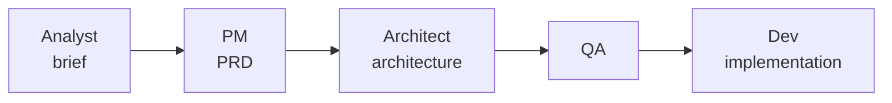

# BMAD Method

BMAD (Breakthrough Method for Agile AI-Driven Development) is the **heavy end** of the
spec-driven spectrum: instead of a single spec file, it runs a pipeline of *role-played
agents* through an agile lifecycle before any code is written. It's a way of applying
[spec-driven development](spec-driven-development.md) with maximum planning ceremony.

## The premise

"Traditional AI tools do the thinking *for* you, producing average results." BMAD's
agents and facilitated workflows instead act as **expert collaborators** that draw out
*your* best thinking in partnership with the AI. The bet is that structured
interrogation up front beats a one-shot prompt.

## What's in it

- **12+ specialized agents** — domain experts (PM, Architect, Developer, UX, and more),
  each a persona you invoke.
- **Structured workflows** grounded in agile best practices across analysis, planning,
  architecture, and implementation.
- **Scale-domain-adaptive** — planning depth auto-adjusts to project complexity, so
  small work doesn't drown in ceremony.
- **Party Mode** — bring multiple agent personas into one session to collaborate and
  debate.
- **Complete lifecycle** — brainstorming through deployment. An in-tool `bmad-help`
  skill advises what's next.

## The pipeline

Böckeler's and Chambers's framing: BMAD role-plays a sequence —
**analyst → PM → architect → QA → dev** — producing a brief, then a PRD, then an
architecture, "before a single line of code is written."

## Where it sits

Same core move as every SDD tool — *break down, pin intent, build* — but at the highest
ceremony setting. Contrast the lightest weight, where a whole "spec" is just a few lines
in a composable `SKILL.md` ([mattpocock/skills](mattpocock-skills.md)), and the middle,
where [spec-kit](github-spec-kit.md) scaffolds files via slash commands. **Match the
ceremony to the stakes.**

## References
- [BMAD-METHOD — GitHub](https://github.com/bmad-code-org/BMAD-METHOD)
