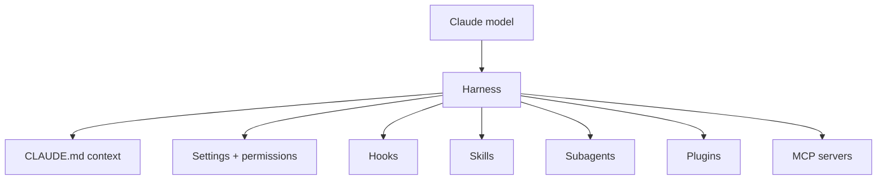

# Claude Code documentation (overview)

Claude Code is Anthropic's agentic coding tool. It runs on the developer's machine,
reads and edits files directly, runs commands, and follows references across a codebase
the way an engineer would — no server-side index required. The docs entry point is a hub;
the substance is in the extension points that turn the raw model into a working *harness*.

## Where it runs

- **Terminal** — the primary CLI.
- **IDE** — a VS Code / JetBrains extension (review diffs inline, open in a tab).
- **Desktop app** — a standalone app: visual diffs, multiple parallel sessions,
  scheduled recurring tasks, and cloud sessions.
- **Web** — `claude.ai/code`, no local setup; kick off long-running or parallel tasks on
  repos you don't have locally (requires a subscription + connected GitHub account).

## The extension points (the harness)

The model matters less than the ecosystem around it. Claude Code is customized through a
small set of composable layers:

- **CLAUDE.md files** — context files auto-loaded every session. A root file for the big
  picture, subdirectory files for local conventions. Keep them focused on what applies
  broadly, since they load on every task.
- **Settings** — `settings.json` (project / user / enterprise scopes) controls
  permissions, environment variables, model choice, and hook registration.
- **Hooks** — shell scripts fired on lifecycle events (pre/post tool use, stop, etc.).
  Beyond blocking bad actions, their high-value use is *self-improvement*: a stop hook can
  reflect on a session and update config.
- **Skills** — packaged instructions + assets that Claude invokes on demand for a task
  type, disclosed progressively so they don't bloat context.
- **Subagents** — isolated Claude instances with their own context window that take a
  task, do it, and return only the result to the parent. Used to split exploration from
  editing.
- **Plugins** — bundles that distribute skills, commands, hooks, and MCP config as a unit
  across a team via a marketplace.
- **MCP servers** — connect Claude to internal tools, data sources, and APIs it can't
  otherwise reach (structured search, docs, ticketing, analytics).
- **SDK / headless** — drive Claude Code programmatically for automation and CI.

These map onto the harness concepts developed across the wiki — see
[Agent runtime](../ai-platform/agent-runtime.md), [Harness engineering](../harness-engineering/harness-engineering.md), and the
detailed treatment in [How Claude Code works in large codebases](how-claude-code-works-large-codebases.md).
For isolation options see [Claude Code sandbox environments](claude-code-sandbox-environments.md).

## Related notes

- [How Claude Code works in large codebases](how-claude-code-works-large-codebases.md)
- [Claude Code sandbox environments](claude-code-sandbox-environments.md)
- [Agent runtime](../ai-platform/agent-runtime.md)
- [Context engineering](../harness-engineering/context-engineering.md)
- [Building effective agents](building-effective-agents.md)

## References

- [Claude Code documentation](https://docs.claude.com/en/docs/claude-code)
