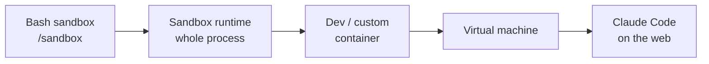

# Choose a Claude Code Sandbox Environment

Isolation limits what a Claude Code session can read, write, and reach on the network. It
matters most when you run with fewer permission prompts, run unattended, or point Claude
at code you don't fully trust. The page frames the options as a **ladder**, from a
lightweight per-command sandbox up to a fully separate VM, chosen by threat model.

## Isolation vs. permission modes

These are orthogonal. **Permission modes** decide *whether* a tool call runs and whether
you're prompted first. **Isolation** restricts *what a command can access* if it does run.
You want both: a permission policy and an OS boundary underneath it.

## The ladder (lightest to heaviest)

| Level | What it isolates | Use when |
| --- | --- | --- |
| **Sandboxed Bash tool** (`/sandbox`) | Filesystem + network of every Bash command | Reduce prompts on your own machine |
| **Sandbox runtime** | The whole Claude Code process — Bash *and* MCP servers, hooks, all tools | Isolate everything without Docker |
| **Dev container** | Full container environment, standardized in-repo | Unattended work; team-wide standard |
| **Custom container** | Any Docker/OCI container you define | Bespoke needs |
| **Virtual machine** | A separate machine | Untrusted repositories |
| **Claude Code on the web** | Anthropic-hosted isolated env | No local setup (subscription + GitHub) |

## The key gap: the per-command sandbox is not the whole session

The built-in Bash sandbox uses **Seatbelt** on macOS and **bubblewrap** on Linux/WSL2. By
default it allows writes to the working directory and prompts the first time a command
needs a new network domain. But it only covers Bash — other built-in tools (Read, Edit,
WebFetch) run *inside* the Claude Code process and are gated by permission rules instead,
and **MCP servers and hooks run unconstrained on the host**.

To put built-in tools, MCP servers, and hooks all behind one OS boundary, run the whole
Claude Code process inside the **sandbox runtime**, a dev container, or a custom
container. The `@anthropic-ai/sandbox-runtime` package wraps the entire process in the
same Seatbelt/bubblewrap isolation as the Bash sandbox — a beta research preview that
**denies all writes and network by default**. Configure it first: in `~/.srt-settings.json`
allow writes to at least the project dir plus `~/.claude` and `~/.claude.json`, and allow
the network domains the session needs (e.g. `api.anthropic.com` or your provider endpoint).

On native Windows use a container/VM or run the Bash sandbox inside WSL2. Organizations
can **enforce** an isolation level across every developer via managed settings.

## Related notes

- [Claude Code documentation](claude-code-documentation.md)
- [Execution sandboxing](../ai-platform/execution-sandboxing.md)
- [Why and how to sandbox AI-generated code](../ai-platform/why-and-how-to-sandbox-ai-generated-code.md)
- [Bun secure sandbox runtime proposal](../ai-platform/bun-secure-sandbox-runtime-proposal.md)
- [Guardrails proxy](../ai-platform/guardrails-proxy.md)

## References

- [Choose a sandbox environment](https://code.claude.com/docs/en/sandbox-environments)
