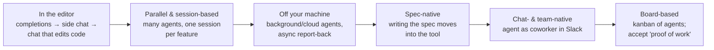

# Coding Interfaces

The interface you drive AI through **keeps adapting as autonomy rises**. Each
jump in what the agent does spawns a new surface, and your job shifts from
typing toward **directing and reviewing**. *"The IDE is dead" misses the
point* — more autonomy needs a *better* review UI, not none.

## The adapting arc

Not a clean replacement — a widening menu. People still drop back to the editor
for line-by-line work. The constant is **direction**: each surface trades a
little more typing for a little more reviewing.

- **In the editor** — autocomplete, then a side chat panel, then a chat that
  edits your actual code.
- **Parallel & session-based** — several agents on the codebase at once,
  separate sessions per feature; UIs manage *sessions* rather than files.
- **Off your machine** — background and cloud agents run long tasks elsewhere,
  reporting back async. Cursor 2.0 mainstreamed this with a multi-agent layout
  and git worktrees.
- **Spec-native** — the *artifact* moves into the tool; writing the
  [spec](spec-driven-development.md) becomes part of the IDE (e.g. Kiro).
- **Chat- & team-native** — the *conversation* moves into Slack/group chat, the
  agent becomes a coworker. Devin in Slack; Anthropic's Claude Tag joins a
  channel as a shared async `@Claude` the whole team delegates to.
- **Board-based** — task boards tracking many agents kanban-style; the human
  accepts *proof of work* rather than watching keystrokes, notifications
  standing in for the loop you used to watch.

## Why it matters: review is the frontier

As agents take on more, you don't need *less* interface — you need a *better*
one pointed at a different job. The bottleneck moves from **writing** code to
**reviewing** it: confirming a long autonomous run did the right thing. The
frontier is the review surface — diff views, test/video evidence that "it
works," PR conversations — not the absence of one.

This is moldable development in new clothes: software is "shapeless," and tools
provide the shape we reason through (Tudor Girba). The more an agent does, the
more the interface must re-present that work in a form a human can **judge**. So
the pattern isn't a *winning* surface but an **adapting** one: as autonomy
climbs through layers — assist → delegate → dispatch (see the
[autonomy ladder](../harness-engineering/autonomy-ladder.md)) — the interface reshapes around review
and direction. The dispatch end is what
[loop engineering](../harness-engineering/loop-engineering-playbook.md) automates.

**Match the surface to the stakes** and to how much you need to understand the
result. More autonomy isn't always better — it just moves where the effort
goes.

## References
- [Coding Interfaces — Tessl Patterns](https://tessl.io/patterns/agentic-development-workflow/coding-interfaces/)
