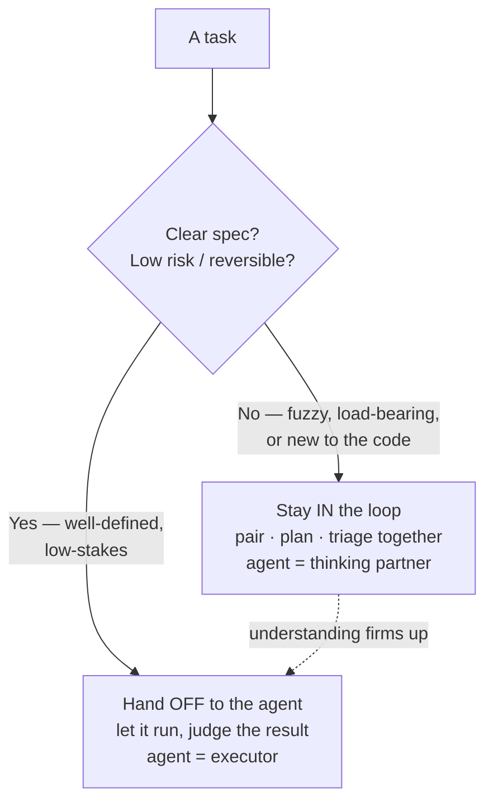

# Collaborating with Agents

Where [orchestration](../ai-org/from-coder-to-orchestrator.md) is the **role** shift,
collaboration is the **per-task** question: for *this* piece of work, **how
closely do you work with the agent?** Not only a coding question — agents are
collaborators in planning, triage, and review as much as implementation.
Swarmia: *"Higher autonomy isn't always better."*

Pairing is the on-ramp (Aider — "AI pair programming in your terminal"), but
pairing is just **one setting on a dial.** Autonomy is *"a single variable: how
much of the work does the agent do autonomously before returning to you for
feedback."* The right level fits the task.

## The dial: clarity × risk

The skill is **routing** — deciding how far into the loop to stay:

- **Unclear or high-stakes → stay in the loop.** Fuzzy spec, load-bearing
  change, or you're new to the code: think out loud, plan and *triage together*,
  co-discover requirements before much code is written. Agent = thinking
  partner, not executor.
- **Clear, low-risk, reversible → hand off.** Reach for autonomy exactly when
  *"the task is so well-defined that you don't need to be present."*

**The rule a team can say out loud:** *if the spec isn't clear, it's a
human-at-the-whiteboard problem; once it's clear, it's an agent problem.* Most
work **starts in the first bucket and graduates** to the second as understanding
firms up — which is why the [in-loop conductor and out-of-loop orchestrator](../ai-org/from-coder-to-orchestrator.md)
modes are the **same person dialing the same knob.**

## Why it matters — wrong setting fails both ways

- **Stay in the loop on everything** → throw the leverage away, hand-steering
  tasks an agent could own.
- **Hand off work that was never clear** → confident, plausible code for the
  *wrong problem*, plus [comprehension debt](../ai-org/comprehension-debt.md) you didn't
  choose.

Matching mode to a task's clarity and stakes is what holds **both** speed *and*
understanding.

## The people half no tool solves

Collaboration norms are adopted **bottom-up** — *"you can't force this top-down;
people resist change done to them."* One team hit "2–3×" only once human work
moved **upstream**, where *"a spec review matters more than a code review."*
Those norms hold only if the team **shares context and conventions** (see
[context engineering](../harness-engineering/context-engineering.md)) so everyone's agents behave
consistently instead of drifting apart. The skill to teach isn't which button to
press but **judgment** — reading a task to know whether it wants a *partner* or
an *executor*, and not defaulting to a private solo run for work others must
maintain.

## Related

- [From Coder to Orchestrator](../ai-org/from-coder-to-orchestrator.md) — the role shift;
  this is the per-task dial within it.
- [The Autonomy Ladder](../harness-engineering/autonomy-ladder.md) — the rungs of how much "what to do
  next" leaves your hands.
- [Context Engineering](../harness-engineering/context-engineering.md) — shared context is what keeps a
  team's agents consistent.

## References
- [Collaborating with Agents — Tessl Patterns](https://tessl.io/patterns/changing-roles/collaborating-with-agents/)
