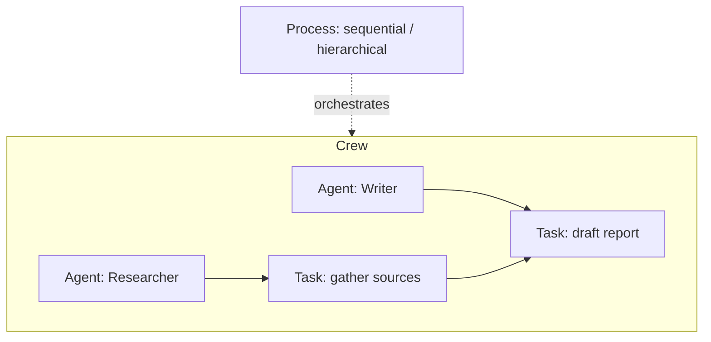

# CrewAI

CrewAI is a framework for orchestrating **role-playing autonomous agents**. The
framing is an organizational metaphor: you assemble a *crew* of agents, each
given a role, a goal, and a backstory, and hand them tasks — much like staffing a
team. That anthropomorphic framing is deliberate; giving an agent a clear
persona and objective steers the LLM's behavior toward that specialization.

## Core building blocks

- **Agent** — an autonomous unit defined by a `role` (who it is), a `goal` (what
  it is trying to achieve), and a `backstory` (context that shapes its voice and
  judgment). An agent may be equipped with tools and its own LLM.
- **Task** — a discrete unit of work with a description and an expected output,
  assigned to an agent. Tasks can depend on and consume the output of earlier
  tasks.
- **Crew** — the collection of agents plus their tasks, run under a **process**
  that governs execution: *sequential* (tasks run in order) or *hierarchical* (a
  manager agent delegates and coordinates).
- **Flow** — event-driven, precise orchestration for when you need explicit
  control over the sequence, branching, and state, rather than leaving it to
  agent autonomy.

## Crews vs. Flows: the autonomy dial

CrewAI's design splits along how much you trust the agents to figure things out:

- **Crews** favor **autonomy and collaboration** — natural, emergent
  problem-solving where agents work like a team. Best when the path isn't fully
  known up front.
- **Flows** favor **precise, deterministic control** — event-driven pipelines
  with explicit state management. Best when you need auditability and repeatable
  sequencing. The two compose: a Flow can invoke Crews as steps.

This role-based, team-metaphor approach is a distinct design point among agent
frameworks — compare the explicit control graph of [LangGraph](langgraph.md) and
the conversation-centric orchestration of [AutoGen](autogen.md). All three
implement the multi-agent and orchestrator-worker ideas from
[building effective agents](building-effective-agents.md), and lean on
tools exposed via the [Model Context Protocol](../ai-platform/model-context-protocol.md).

## References

- [CrewAI documentation](https://docs.crewai.com)
