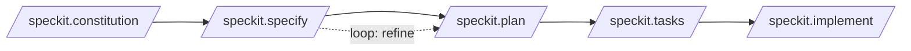

# GitHub Spec Kit

GitHub's open-source toolkit for [spec-driven development](spec-driven-development.md).
It ships as a **`specify` CLI** that scaffolds a spec workflow into your repo for 30+
AI coding agents (CLI and IDE-based); you then drive the workflow via **slash commands**
inside your assistant. Because all artifacts land directly in your workspace, it's the
most customizable of the mainstream SDD tools (compare
[Kiro and Tessl](understanding-sdd-kiro-spec-kit-tessl.md)).

## Core philosophy

- **Intent-driven** — specs define the *what* before the *how*.
- **Rich specification** — guardrails and organizational principles, not a bare prompt.
- **Multi-step refinement** over one-shot generation.
- Heavy reliance on advanced model capability to interpret specs.

## The workflow

The workflow is anchored by a **constitution** — a memory-bank file of "immutable" high-
level principles applied to every change (a powerful rules file). Each workflow step
instantiates files and prompts from templates via a bash script, and each file carries
**checklists** that act as an AI-interpreted "definition of done" (clarifications,
constitution violations, research tasks). One spec becomes many files (spec, plan,
tasks, data-model, research, api, component…).

### Core slash commands

| Command | Purpose |
| --- | --- |
| `/speckit.constitution` | Establish governing principles |
| `/speckit.specify` | Define *what* to build (requirements, user stories) |
| `/speckit.plan` | Technical plan with chosen tech stack |
| `/speckit.tasks` | Generate actionable task list |
| `/speckit.implement` | Execute all tasks to build the feature |
| `/speckit.converge` | Reassess codebase vs. spec, append remaining work |

### Optional (quality)

- `/speckit.clarify` — sequential, coverage-based questioning of underspecified areas
  (recommended before `/plan`). This "interrogate before you spec" move is the same one
  Matt Pocock isolates as [grill-me](mattpocock-skills.md).
- `/speckit.analyze` — cross-artifact consistency & coverage check.
- `/speckit.checklist` — custom quality checklists, "unit tests for English."

## The stronger claim

GitHub aspires beyond spec-first toward **spec-anchored**: "maintaining software means
evolving specifications… code is the last-mile approach." Whether the file-heavy
scaffolding pays off is exactly the open question raised in
[Understanding SDD](understanding-sdd-kiro-spec-kit-tessl.md).

## References
- [GitHub Spec Kit](https://github.com/github/spec-kit)
