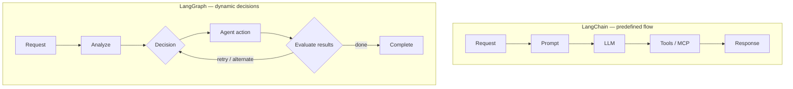

# LangChain vs LangGraph: Automation vs Agentic AI

A whiteboard comparison framing the two as **workflow automation vs agentic AI**.

## LangChain — workflow automation (predefined flow)

Linear, predefined, deterministic: user request → prompt/template → LLM → tools (MCP
server) → API/database/systems → response. Best for RAG apps, Q&A bots, document
processing, simple automations, tool integrations.

## LangGraph — agentic AI (dynamic decision making)

User request → analyze/understand → **decision node** routing to agents (retrieve data /
multi-agent research / execute action via MCP) → **evaluate results (quality/validation)**
→ another decision node → complete, retry with a different strategy, or escalate to a
human. Loops back via re-evaluate / retry / alternate paths.

**Key difference:** LangChain *executes workflows*; LangGraph *decides, adapts, and
achieves goals*. Use LangGraph when there are multiple possible outcomes,
decisions-based-on-results, loops & retries, dynamic planning, multi-agent coordination,
or long-running tasks.

> Automation follows instructions. Agentic AI achieves objectives.

## The two shapes

## Cross-links

The evaluate → decide → retry loop is exactly [Engineer the Loop, Not the
Prompt](../harness-engineering/engineer-the-loop.md). The automation/agency split is the two ends of
[The Double Dovetail](../harness-engineering/double-dovetail.md); the multi-agent routing appears in
[Agentic Engineering Core](agentic-engineering-core.md).
