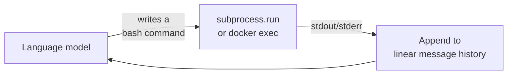

# mini-SWE-agent

A **100-line Python AI agent** that solves GitHub issues (or helps at the command
line) — "radically simple, no huge configs, no giant monorepo" — yet scores **>74% on
[SWE-bench Verified](../ai-platform/swe-bench-leaderboard.md)**. It's the successor to SWE-agent
(which jump-started agentic coding in 2024), and its whole thesis is that as models
got more capable, most of the elaborate tooling and special interfaces that early
agents needed turned out to be unnecessary.

## Three design choices that make it tiny

- **Bash is the only tool.** It doesn't implement custom tools and doesn't even use
  the LM's tool-calling interface — the model just writes shell commands. Want it to
  open a PR? Tell the LM to figure it out with `git` and `gh`, rather than building a
  tool. Because there's no tool-calling dependency, it runs with **literally any
  model**.
- **Actions run via `subprocess.run` — no persistent shell.** Every action is fully
  independent instead of sharing a stateful shell session. Swap `subprocess.run` for
  `docker exec` and it runs sandboxed; swap it again and it scales across many
  environments. Statelessness is what makes it trivial to sandbox and parallelize.
- **Completely linear history.** Each step just appends to the message list — the
  trajectory *is* the prompt. Nothing hidden, which makes it excellent for debugging
  and for generating fine-tuning data.

## Why it matters

mini-SWE-agent deliberately puts the **model, not the scaffold, at the center of
attention** — which is exactly why the [SWE-bench leaderboard](../ai-platform/swe-bench-leaderboard.md)
uses it as the constant "bash only" harness to compare models fairly. It's the
minimalist counterpoint to feature-heavy agents: simple enough to understand at a
glance, convenient for daily use, and flexible to extend. A strong illustration that a
capable model plus a *tiny, clean* harness can beat elaborate scaffolding — and a
concrete baseline for thinking about [agent runtime](../ai-platform/agent-runtime.md) and
[harness engineering](../harness-engineering/harness-engineering.md).

## Related

- [SWE-bench Leaderboard](../ai-platform/swe-bench-leaderboard.md) — uses mini as the constant scaffold.
- [Agent Runtime](../ai-platform/agent-runtime.md) — where a bash-only, stateless agent sits.
- [Harness Engineering](../harness-engineering/harness-engineering.md) — model-plus-harness, minimized.

## References
- [mini-SWE-agent (GitHub)](https://github.com/SWE-agent/mini-SWE-agent)
