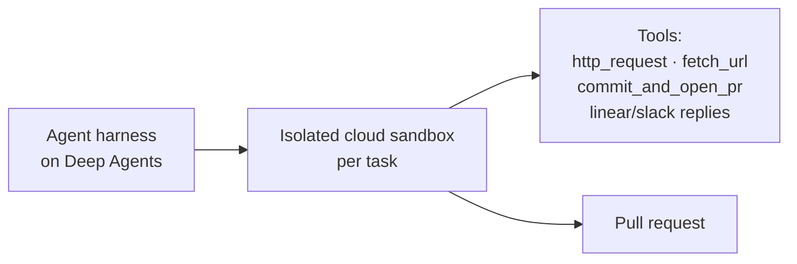

# Open SWE: An Open-Source Framework for Internal Coding Agents

LangChain's open-source framework for building **internal coding agents** — agents
that take a task, run in an isolated cloud environment, and come back with a pull
request. It is an open instance of the [Agent Runtime](../ai-platform/agent-runtime.md) pattern
(a "CI/CD runner farm, but for agents") applied to software work.

## Architecture

**1. Agent harness composed on Deep Agents.** Rather than forking an existing agent
or building from scratch, Open SWE **composes** on LangChain's Deep Agents framework
(the same pattern by which Ramp built Inspect on OpenCode). Composition gives two
advantages: an **upgrade path** (improvements to Deep Agents — better context
management, planning, token usage — flow in without a rebuild) and **customization
without forking** (org-specific tools, prompts, and workflows live as configuration,
not core-logic edits). Deep Agents supplies built-in planning (`write_todos`),
file-based context management, native subagent spawning (the `task` tool), and
middleware hooks for deterministic orchestration.

**2. Isolated cloud sandboxes.** Each task runs in its **own remote Linux sandbox**
with full shell access: the repo is cloned in, the agent gets complete permissions
*inside* the boundary, and any errors are contained. This is the recurring pattern —
**isolate first, then grant full permissions within the boundary**. Open SWE
supports multiple sandbox providers out of the box (Modal, Daytona, Runloop,
LangSmith) and lets you plug in your own.

Key sandbox behaviors:

- Each conversation thread gets a **persistent** sandbox, reused across follow-ups.
- Sandboxes **auto-recreate** if they become unreachable.
- **Multiple tasks run in parallel**, each in its own sandbox.

## Related

- [Agent Runtime](../ai-platform/agent-runtime.md) — the pattern; Open SWE is named as an open
  instance alongside Codex cloud tasks and Cursor background agents.
- [Execution Sandboxing](../ai-platform/execution-sandboxing.md) — the isolate-first boundary each
  task runs inside.
- [Loop Engineering](../harness-engineering/loop-engineering.md) — designing the loop the runtime executes.

## References
- [Open SWE: An Open-Source Framework for Internal Coding Agents — LangChain Blog](https://www.langchain.com/blog/open-swe-an-open-source-framework-for-internal-coding-agents)
