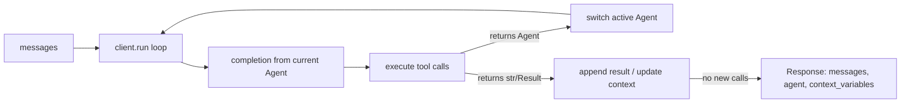

# OpenAI Swarm

Swarm is an **experimental, educational** framework from OpenAI's Solution team for
lightweight multi-agent orchestration. It is explicitly *not* for production — the README
now points to the [OpenAI Agents SDK](https://github.com/openai/openai-agents-python) as
its production-ready successor. Swarm remains a clean reference for understanding *how*
multi-agent coordination works.

## The idea

Swarm makes agent **coordination** and **execution** lightweight, controllable, and
testable through two primitives:

- **`Agent`** — a set of `instructions` plus a set of `functions` (tools). Don't over-
  personify it: an Agent can equally represent a specific workflow, task, or single step.
  Agents compose into networks of "agents", "workflows", and "tasks" using the same
  primitive.
- **Handoff** — an Agent can, at any point, hand the conversation off to another Agent.

Swarm runs almost entirely on the client and is **stateless between calls** — it's powered
by the Chat Completions API, so it stores no state (unrelated to the Assistants API despite
the similar "Agent" naming). It suits situations with many independent capabilities and
instructions that are hard to cram into a single prompt.

## How it runs — `client.run()`

Analogous to `chat.completions.create()`: takes `messages`, returns `messages`, saves no
state — but additionally handles tool execution, handoffs, and context variables, and can
take multiple turns before returning. Its core loop:

1. Get a completion from the current Agent.
2. Execute tool calls and append results.
3. Switch Agent if a tool handed off.
4. Update context variables if needed.
5. If no new function calls, return.

The returned `Response` carries the final `messages`, the active `agent`, and updated
`context_variables`.

## Functions, handoffs, and context

Agents call Python functions directly. Conventions that drive the orchestration:

- A function should return a `str` (values get cast to `str`).
- **If a function returns an `Agent`, execution transfers to that Agent** — this is how a
  handoff is expressed (e.g. `def transfer_to_sales(): return sales_agent`).
- A function with a `context_variables` parameter receives the dict passed into
  `client.run()`.
- To do more than one thing at once, return a `Result` object carrying any subset of a
  `value`, an `agent` (handoff), and updated `context_variables`.

```python
from swarm import Swarm, Agent

client = Swarm()

def transfer_to_agent_b():
    return agent_b

agent_a = Agent(name="Agent A", instructions="You are a helpful agent.",
                functions=[transfer_to_agent_b])
agent_b = Agent(name="Agent B", instructions="Only speak in Haikus.")

response = client.run(agent=agent_a,
                      messages=[{"role": "user", "content": "I want to talk to agent B."}])
```



Compared with the handoff/decentralized pattern in
[A practical guide to building agents](a-practical-guide-to-building-agents.md), Swarm is
that pattern distilled to its minimum: a handoff is just "return the next Agent."

## Related notes

- [A practical guide to building agents](a-practical-guide-to-building-agents.md)
- [Building effective agents](building-effective-agents.md)
- [Agent patterns quick reference](agent-patterns-quick-reference.md)
- [Agent runtime](../ai-platform/agent-runtime.md)

## References

- [OpenAI Swarm](https://github.com/openai/swarm)
