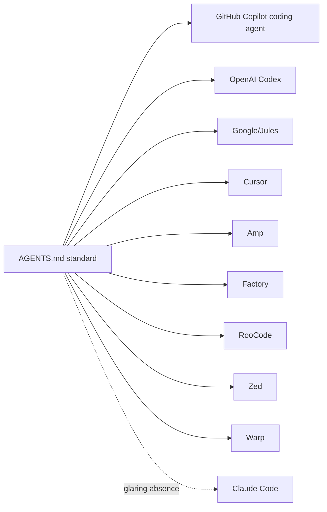

# The Rise of AGENTS.md — An Open Standard and Single Source of Truth

Paul Sawers (Tessl) tracks how `AGENTS.md` became the **vendor-neutral standard**
for telling AI coding agents how to work in a project. Instead of scattering the
same instructions across tool-specific files, a repo maintains **one `AGENTS.md`**
— setup commands, build steps, code conventions, testing workflows — and every
supported agent knows to look there first. It sits alongside `README.md` as the
one predictable place agents always check.

## What it is

- A **lightweight, Markdown-based** instruction file at the repo root, structured
  into clear sections: environment setup, testing, security considerations, PR
  guidelines. Keep it **concise, well-organized, and parseable** by both humans
  and agents. (For *how* to make it good, see [writing a great
  agents.md](writing-a-great-agents-md.md).)
- **Nested files supported.** You can add `AGENTS.md` in subdirectories
  (`/frontend`, `/api`); an agent uses the **nearest one by walking up the
  directory tree**, so each part of a monorepo can carry its own instructions.

## Migrating — or not

Transitioning is a rename plus a symlink for backward compatibility:

```bash
mv CLAUDE.md AGENTS.md && ln -s AGENTS.md CLAUDE.md
```

New tools read `AGENTS.md`; older ones expecting the previous filename keep
working. Not everyone needs to migrate, though — single-tool users, teams with a
robust working setup, or teams where changing established workflows would cause
friction may reasonably stay put.

## Who supports it



GitHub, OpenAI, and Google all added formal support, alongside Cursor, Amp,
Factory, RooCode, Zed, Warp, and others. **The one glaring absence: Claude
Code.** Anthropic's repo has been flooded with requests to support `AGENTS.md`
(one user: *"CLAUDE.md feels too specific to Claude Code… it doesn't work as well
when collaborating with developers who aren't using it"*). A suggested fix is a
**dual-file approach** — default to `CLAUDE.md` when present, fall back to
`AGENTS.md` — so Claude keeps its tailored features while working out-of-the-box
on repos already using the standard.

## The deeper point

A Kilo Code post (Darko) offers a sharp reframe: maybe `AGENTS.md` is **less
about helping AI and more about tricking us into writing documentation we'd
otherwise avoid**. Because you write it *for the AI*, the payoff is **immediate**
— write it once and your assistant is instantly more useful — versus the long,
weak feedback loop of a `README`.

## Related

- [Writing a great agents.md](writing-a-great-agents-md.md) — the 2,500-repo playbook for content.
- [Four-files AI workflow](four-files-ai-workflow.md) — how instruction files compose.
- [Context engineering](../harness-engineering/context-engineering.md) — one canonical instruction file as high-signal context.

## References
- [The rise of Agents.md, an open standard and single source-of-truth for AI coding agents — Tessl](https://tessl.io/blog/the-rise-of-agents-md-an-open-standard-and-single-source-of-truth-for-ai-coding-agents/)
