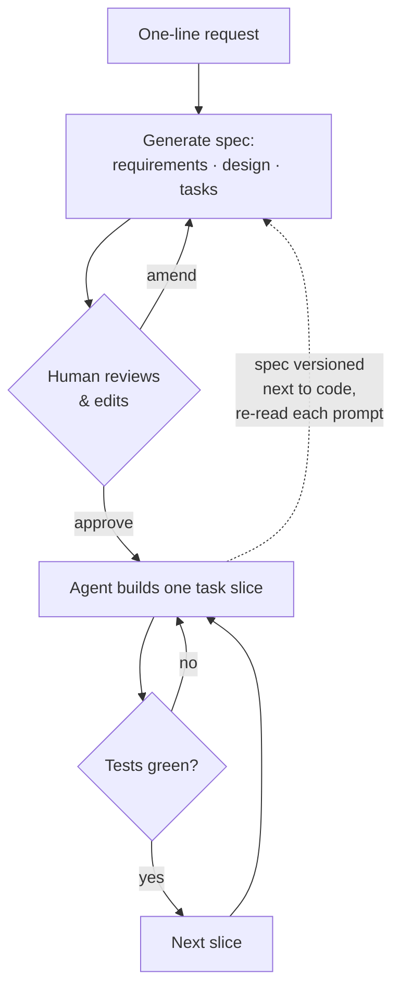

# Spec-Driven Development

The structured counterpart to [vibe coding](vibe-coding.md). Before the agent
writes code, you produce a **specification** — requirements, user stories,
design, and a task breakdown — as an editable, human-readable artifact. The
agent builds against it. The spec captures intent **durably**, so it outlives
the chat history and the model's context window.

## The pattern: invert the order

Vibe coding prompts its way to working code and hopes it matches intent.
Spec-driven development inverts that: **spec first, then build**. The prompt
doesn't disappear — it gets *captured*. Intent stops living in ephemeral chat
history and becomes a durable input the agent (and the next teammate) works
from.

Sean Grove pushes this to its conclusion: specifications — not prompts, not
code — become *"the source of truth that compiles to documentation,
evaluations, model behaviors, and maybe even code."*

The method crystallized around a wave of tools — **AWS Kiro**, **GitHub Spec
Kit**, the **Tessl Framework** — that turn a one-line request into structured
markdown you review and amend *before* any code is written.

## Why it matters

Vibe coding is fast but "often produces code that doesn't match what you asked
for" (Andrew Ng) — a chasm sits between a magical prototype and a deployable
system. Spec-driven development **front-loads alignment** and leaves artifacts
that outlive the developer's memory and the model's context. Whoever picks the
project up later inherits the *why*, not just a chat log.

## It's not a new waterfall

The objection: it's "just waterfall with an AI doing the typing" — betting
everything on a spec written before you learned anything. Two things make it a
**loop, not a one-way handoff**:

- **Broken down, not written whole.** The request decomposes into a task list
  built one slice at a time — the agent takes a slice until its tests go green,
  then the next. *"The spec isn't a promise the agent makes, it's a test it has
  to pass… the value is in the feedback loop"* (John Ferguson Smart).
- **Spec *and* code, not spec alone.** The spec is versioned next to the code
  and re-read on each prompt, so every feature is built against both the intent
  and what already runs.

That step-by-step grounding is exactly what waterfall lacks.

## The honest caveat

- **Intent, not truth.** A spec is the source of *intent*; the code is what
  actually runs.
- **No perfect one-sweep.** Generation is non-deterministic — the same spec
  yields different code across models, or even twice on one model, so it drifts
  from any frozen version.
- **Worth it when it lasts.** The effort pays off for work with stakes and a
  lifespan; for a throwaway it's overhead. **Vibe to find the idea, spec to
  build the thing you keep** — see [vibe coding](vibe-coding.md).

## References
- [Spec-Driven Development — Tessl Patterns](https://tessl.io/patterns/agentic-development-workflow/spec-driven-development/)
