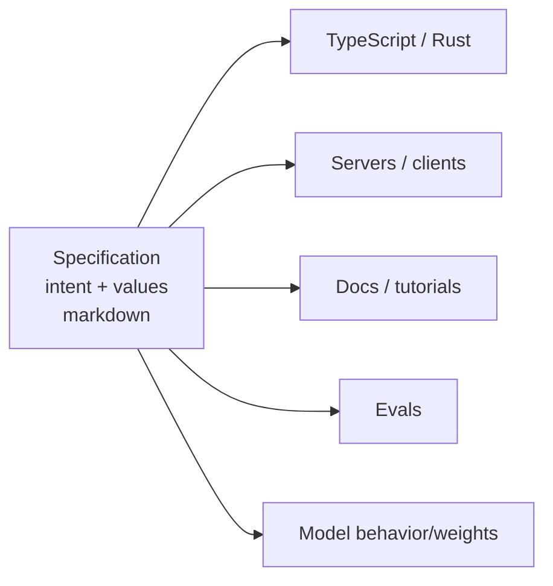

# The New Code: Specifications as the Source of Truth

Sean Grove (OpenAI, alignment research) at the AI Engineer World's Fair, making the
strongest version of the [spec-driven development](spec-driven-development.md) argument:
**the specification — not the code — is the valuable artifact**, and whoever writes the
best specs becomes the most valuable programmer.

## Code is ~10-20% of the value

The tangible artifact we produce and debate is code, but that undersells the job. The
other 80-90% is **structured communication**: talking to users, distilling stories,
ideating goals, planning, sharing plans, translating to code, testing, and verifying
that the code actually achieved the intent. Structured communication is the real
bottleneck — and as models improve, *"the person who communicates most effectively is
the most valuable programmer."* If you can communicate effectively, you can program.

## The vibe-coding paradox

[Vibe coding](vibe-coding.md) feels good because it's communication-first: you describe
intent, the model does the grunt work. But then we **keep the generated code and throw
the prompt away** — like shredding the source and version-controlling the binary. We
regenerate binaries from source every build; we should treat the *spec* as the source
and the code as the compiled output.

Code is a **lossy projection** of intent. Decompile a binary and you lose the comments
and good names; read even clean code and you must *infer* the team's goals. A
sufficiently robust specification, by contrast, contains enough to generate good
TypeScript, Rust, servers, clients, docs, tutorials — even a podcast. This mirrors the
Tessl "spec-as-source" ambition noted in
[Understanding SDD](understanding-sdd-kiro-spec-kit-tessl.md), and is a stronger claim
than RedMonk's "source of *intention*"
([vibe vs. spec](vibe-coding-vs-spec-driven-development.md)).

## Case study: the OpenAI Model Spec

The **Model Spec** is a living, open-sourced set of markdown files expressing the
values OpenAI wants its models to embody. Markdown is human-readable, versioned,
change-logged, and natural-language — so product, legal, safety, policy, and research
can all read, debate, and contribute to one source.

- **Success criteria are embedded.** Each clause has an ID (e.g. `sy73`); a matching
  file holds challenging prompts that test adherence to that clause — the spec is its
  own eval. See [evals / LLM as a judge](../ai-platform/evals-llm-as-a-judge.md).
- **The sycophancy episode.** When a GPT-4o update turned sycophantic, the Model Spec's
  "don't be sycophantic" section made it unambiguous that the behavior was a *bug*, not
  a choice. The spec served as a **trust anchor** — a public statement of what is and
  isn't expected — while the fix rolled out.

## Specs align models, not just humans

Beyond aligning people, the same spec aligns the model. Via **deliberative alignment**,
you feed the spec plus hard prompts, sample the model, and have a stronger model score
the response *against the spec* — turning the document into both training and eval
material, pushing the policy from inference-time context down into the weights.

## Specs behave like code

Specifications **compose, are executable, are testable, expose interfaces, and ship as
modules.** You can imagine type-checkers (catch conflicts between two teams' specs
before publishing), unit tests (the embedded challenge prompts), and linters (flag
overly ambiguous language that will confuse both humans and models). This is the same
"spec is a test the agent must pass" loop discussed in
[spec-driven development](spec-driven-development.md).

## Takeaway

*"If you don't have a specification, you just have a vague idea."* The new scarce skill
is writing specs that fully capture intent and values — a universal principle already
practiced by coders, product managers, and lawmakers alike.

## References
- [The New Code — Sean Grove, OpenAI (AI Engineer World's Fair)](https://www.youtube.com/watch?v=8rABwKRsec4)
