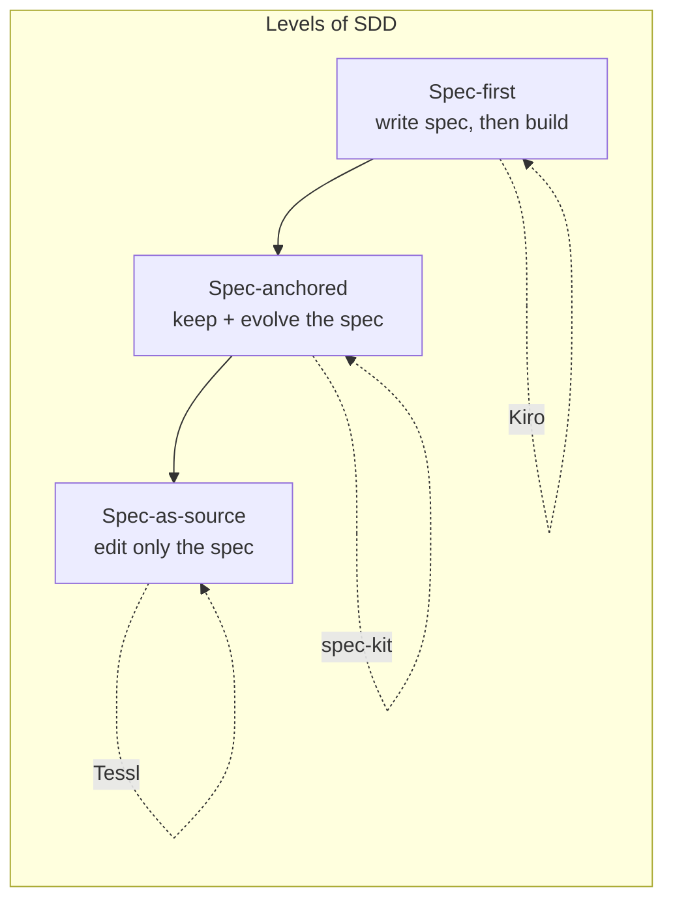

# Understanding Spec-Driven Development: Kiro, spec-kit, and Tessl

Birgitta Böckeler (Thoughtworks) tries to untangle what "spec-driven development" (SDD)
actually *means* by examining three tools that all claim the label — and finds they are
quite different. The first lesson: **SDD is not just one thing.** Complements the
general [spec-driven development](spec-driven-development.md) note with a concrete,
tool-by-tool comparison.

## A working definition — with three levels

SDD means writing a "spec" before writing code with AI ("documentation first"); the
spec becomes the source of truth for human and AI. But usage spans three levels:

1. **Spec-first** — a well-thought-out spec is written first, then used for the task at
   hand.
2. **Spec-anchored** — the spec is *kept after* the task completes, to drive evolution
   and maintenance of that feature over time.
3. **Spec-as-source** — the spec is the main source file; the human edits only the spec
   and never touches the code. (Tessl's aspiration; the industry is not there yet.)

## The three tools

Each has a **memory bank** (persistent principles/context) plus a **spec workflow**.

- **Kiro** — the most lightweight. Workflow: **Requirements → Design → Tasks**, one
  markdown doc each, inside a VS Code distribution. Requirements are user stories with
  GIVEN/WHEN/THEN acceptance criteria; tasks trace back to requirement numbers and run
  one-by-one. Memory bank = "steering" (default `product.md`, `structure.md`,
  `tech.md`). Mostly spec-first. See [Introducing Kiro](introducing-kiro.md).
- **spec-kit** (GitHub) — a CLI that scaffolds many coding assistants; you drive it via
  slash commands. Workflow: **Constitution → (Specify → Plan → Tasks)** looped. The
  memory bank is a **constitution** of immutable principles. Heavy use of in-file
  checklists as a "definition of done" per step. One spec = many files. The most
  customizable. Aspires to spec-anchored. See [GitHub Spec Kit](github-spec-kit.md).
- **Tessl** — aspires furthest, toward spec-as-source: "specs — not code — are the
  primary artifact."

## The honest skepticism

Böckeler notes the spec-first *principle* is genuinely valuable — she does it herself.
But "spec-driven development" is poorly defined and already
[semantically diffused](https://martinfowler.com/bliki/SemanticDiffusion.html) (some
use "spec" as a synonym for "detailed prompt"). Her worry: the more elaborate,
file-heavy tools may feed AI our *existing* workflows too literally, amplifying review
overload and hallucination — a *Verschlimmbesserung* (making something worse in the
attempt to make it better). This echoes the "not a new waterfall" tension in
[spec-driven development](spec-driven-development.md).

## References
- [Understanding Spec-Driven-Development: Kiro, spec-kit, and Tessl — Birgitta Böckeler](https://martinfowler.com/articles/exploring-gen-ai/sdd-3-tools.html)
