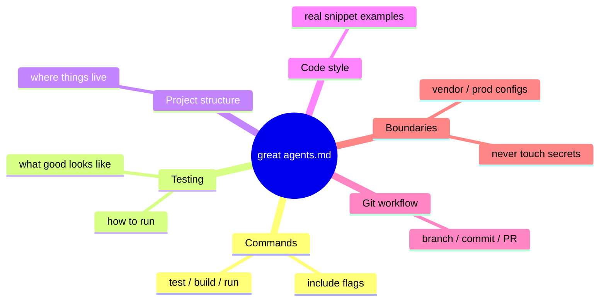

# How to Write a Great agents.md — Lessons from 2,500+ Repositories

Matt Nigh (GitHub) analyzed **over 2,500 `agents.md` files** and found a clear
divide between the ones that fail and the ones that work. The failures are vague
helpers; the successes are **specialists** — files that read like a detailed
operating manual, not a mood-setting prompt. An `agents.md` is the vendor-neutral
instruction file coding agents look for (see [the rise of
AGENTS.md](rise-of-agents-md.md)); this post is about making it *good*.

## What the best files do differently

- **Put executable commands early.** `npm test`, `npm run build`, `pytest -v` —
  with flags and options, not just tool names. The agent references these
  constantly.
- **Code examples over explanations.** One real snippet showing your style beats
  three paragraphs describing it. Show what good output looks like.
- **Set clear boundaries.** Tell the AI what it must **never touch** — secrets,
  vendor directories, production configs, specific folders. *"Never commit
  secrets"* was the single most common helpful constraint.
- **Be specific about the stack.** "React 18 with TypeScript, Vite, and Tailwind
  CSS," not "React project." Include versions and key dependencies.

## The six core areas

Covering these six puts a file in the top tier:

## How to build one

- **Start simple. Test it. Add detail when the agent makes mistakes.** The best
  files **grow through iteration, not upfront planning** — the same
  failure-driven refinement Anthropic recommends for system prompts in
  [effective context engineering](../harness-engineering/effective-context-engineering-anthropic.md).
- Give the agent a clear **persona** plus a concrete operating manual —
  executable commands, style examples, explicit boundaries, and stack specifics.

An adjacent GitHub finding underscores the stakes: when GitHub migrated Copilot
code review to shared tooling it *initially got worse*, and **rewriting the
instructions** restored accuracy and cut costs ~20%. The instructions are the
product.

## Related

- [The rise of AGENTS.md](rise-of-agents-md.md) — the standard this file conforms to.
- [Four-files AI workflow](four-files-ai-workflow.md) — where agents.md sits among the guiding files.
- [Context engineering](../harness-engineering/context-engineering.md) — agents.md is progressive-disclosure context.

## References
- [How to write a great agents.md: Lessons from over 2,500 repositories — The GitHub Blog](https://github.blog/ai-and-ml/github-copilot/how-to-write-a-great-agents-md-lessons-from-over-2500-repositories/)
