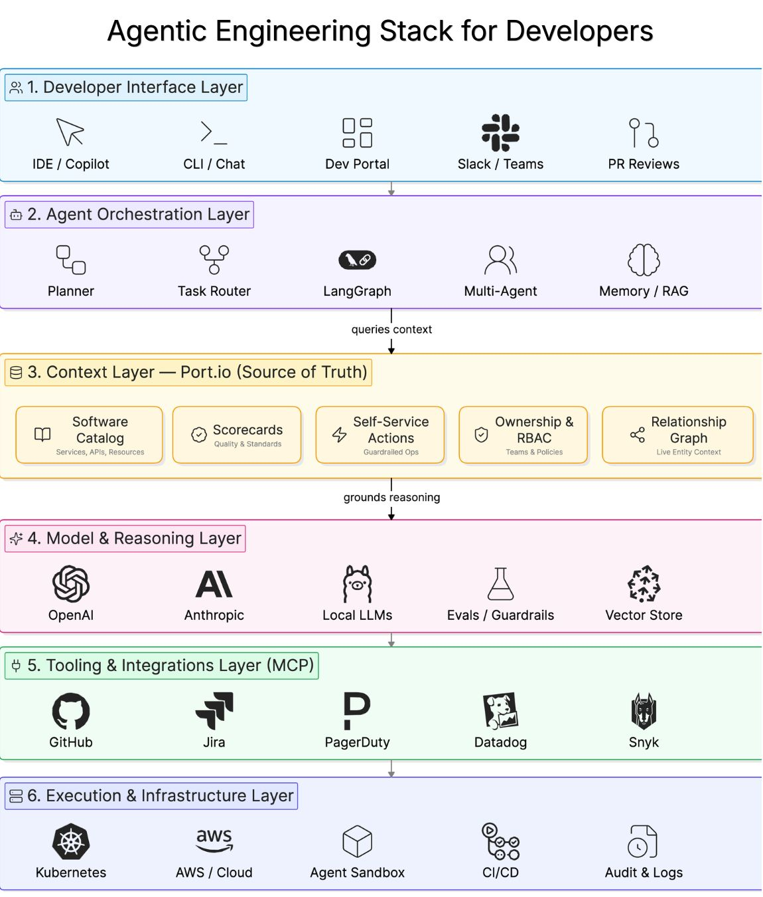

# Agentic Engineering Stack for Developers

A six-layer reference stack for building agentic developer tooling, top (human-facing)
to bottom (infrastructure).

| # | Layer | Examples |
|---|---|---|
| 1 | Developer Interface | IDE/Copilot, CLI/Chat, Dev Portal, Slack/Teams, PR reviews |
| 2 | Agent Orchestration | Planner, task router, LangGraph, multi-agent, memory/RAG |
| 3 | Context (source of truth) | Software catalog, scorecards, self-service actions, ownership & RBAC, relationship graph (shown as Port.io) |
| 4 | Model & Reasoning | OpenAI, Anthropic, local LLMs, evals/guardrails, vector store |
| 5 | Tooling & Integrations (MCP) | GitHub, Jira, PagerDuty, Datadog, Snyk |
| 6 | Execution & Infrastructure | Kubernetes, AWS/Cloud, agent sandbox, CI/CD, audit & logs |

Flow annotations: layer 3 **queries context** for orchestration and **grounds
reasoning** for the model layer — context sits between orchestration and the model as
the source of truth.

## Cross-links

An architecture view complementing the five-layer runtime harness in
[Agent Harness Engineering](agent-harness-engineering.md) (orchestration, context,
tools/MCP, verification, operations all appear here as layers). See also
[Layers of AI](layers-of-ai.md) for the technique stack underneath the model layer.

## References

- 
