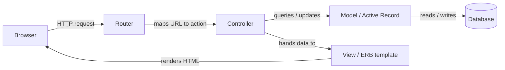

# Agile Web Development with Rails 6

The canonical, tutorial-driven introduction to Ruby on Rails by Sam Ruby, David
Bryant Copeland, and Dave Thomas (Pragmatic Bookshelf, 2020). It teaches Rails not
as a reference manual but by building a real application end to end, letting the
framework's conventions emerge from the work rather than from lists of rules.

## Rails philosophy

Rails is opinionated software. Instead of offering endless configuration knobs, it
picks sensible defaults and asks you to follow them, which lets a huge amount of
plumbing disappear:

- **Convention over configuration** — name a model `Product` and Rails infers the
  table `products`, the primary key `id`, the controller `ProductsController`, and
  the view folder `products/`. You only write config where you deviate from the
  convention, so most apps need almost none.
- **DRY (Don't Repeat Yourself)** — each piece of knowledge lives in exactly one
  place. Schema is inferred from the database, associations are declared once,
  shared markup goes in layouts and partials.
- **Opinionated defaults** — the "Rails way" is a paved path: RESTful routes, a
  standard directory layout, a prescribed request lifecycle. Following it makes any
  Rails codebase legible to any Rails developer.

These ideas rhyme with the Ruby-craft notes here on
[Practical Object-Oriented Design in Ruby](practical-object-oriented-design-in-ruby.md)
(managing dependencies, small focused objects) and
[Refactoring: Ruby Edition](refactoring-ruby-edition.md) (small, safe,
behavior-preserving steps) — Rails supplies the framework conventions; those books
supply the design discipline for the code you write inside it.

## MVC in Rails

Rails is a Model-View-Controller framework. A browser request flows through the
stack and back:

- **Model** — domain objects and business rules, backed by Active Record.
- **View** — templates (ERB by default) that render the response.
- **Controller** — receives the routed request, coordinates models, and selects the
  view. Action Pack bundles the controller and view layers together.

## The Depot sample-app arc

The spine of the book is **Depot**, an online store built incrementally. Work is
organized into *tasks* (features) broken into small *iterations*, mirroring an agile
cadence — ship something working, then extend it:

- **Task A–B** — scaffold product maintenance (CRUD), then add validations and unit
  tests for the model.
- **Task C** — build the customer-facing catalog, add a page layout, a price helper,
  controller (functional) tests, and partial caching.
- **Task D–E** — introduce the shopping cart: find or create a cart per session,
  link products to it, add "Add to Cart" buttons, then make the cart smarter and
  handle errors.
- **Task F** — sprinkle in Ajax and real-time updates, culminating in broadcasting
  cart changes over Action Cable.
- **Task G–H** — checkout: capture an order, publish an Atom feed, and collect
  payment details.
- Later tasks layer in **sending email**, **login/authentication**,
  **internationalization**, and finally **deployment**.

Each iteration follows the same loop: change the code, run the tests, see it work in
the browser, repeat.

## Active Record and migrations

Active Record is Rails' ORM. A model class maps to a table; instances map to rows;
columns become attributes automatically — you don't declare them. Associations
(`has_many`, `belongs_to`) and validations are declared in the model.

Schema changes are versioned as **migrations**: small Ruby classes describing a
change (create a table, add a column). Running them evolves the database forward;
they can be rolled back. Because migrations are code checked into the repo, every
developer and every environment converges on the same schema.

## Routing, controllers, and views

- **Routing** maps incoming URLs to controller actions. Rails favors **RESTful
  routes** — `resources :products` generates the standard index/show/new/create/
  edit/update/destroy set in one line.
- **Controllers** hold one public method per action, set instance variables, and
  either render a view or redirect.
- **Views** are ERB templates that read those instance variables. Shared chrome
  lives in **layouts**; reusable fragments live in **partials**; formatting logic
  lives in **helpers**.

## Testing Rails apps

Testing is woven through the tutorial, not bolted on. Rails ships with a test
harness and generates test stubs alongside the code it scaffolds:

- **Model / unit tests** verify validations and business logic.
- **Controller / functional tests** exercise actions through simulated requests and
  assert on responses and side effects.
- **Fixtures** provide known seed data.
- **System tests** drive a real browser for end-to-end coverage.

The agile rhythm depends on this: a green suite is what makes each small iteration
safe to build on — the same feedback loop the
[Refactoring: Ruby Edition](refactoring-ruby-edition.md) discipline relies on.

## Rails 6 specifics

The Rails 6 edition foregrounds several features new or matured in that release:

- **Action Text** — rich-text (WYSIWYG) content editing and storage, built on the
  Trix editor and integrated with Active Storage.
- **Action Mailbox** — routes *inbound* email into the application (the mirror of
  Action Mailer's outbound side), letting the app react to received messages.
- **Multiple databases** — first-class support for connecting a single app to
  several databases, including automatic read/write splitting between primary and
  replica.
- **Webpacker** — the default JavaScript bundling pipeline in Rails 6, wrapping
  webpack so modern JS/npm tooling drives the front-end assets.

## References

- [Agile Web Development with Rails 6 — Pragmatic Bookshelf](https://pragprog.com/titles/rails6/agile-web-development-with-rails-6/)
