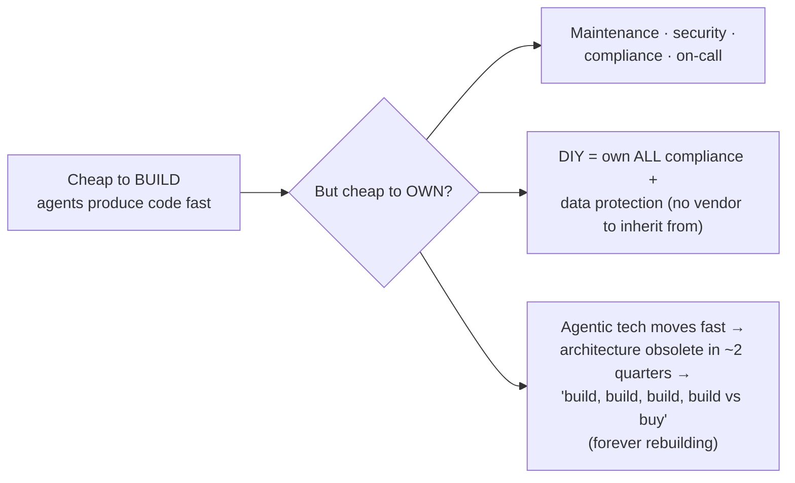

# Build vs Buy

When agents make custom software **dramatically cheaper to produce**, the
build-versus-buy **threshold shifts.** Capabilities that were "just buy the
SaaS" (building wasn't worth the engineering time) become viable to build
in-house, and some teams start **replacing third-party tools** with internal
alternatives tailored to exactly their workflow.

Shapiro's underlying force — **"technical deflation":** the cost of producing
code is dropping fast enough that the smart move is to *"defer payment on human
hours today to pay them back with cheaper AI hours tomorrow."* The build curve
dropped hardest for the **unglamorous middle** — internal tools, integrations,
data pipelines, workflow automation — exactly the territory SaaS used to win by
default.

## Cheap to build ≠ cheap to own

The shift is real but **easy to over-read.** Internal software still needs
maintenance, security, compliance, on-call — and DIY means owning *"all aspects
of compliance and data protection yourself"* rather than inheriting from a
vendor. For agentic systems ownership cost is **worse** — the tech moves so fast
today's architecture is obsolete in a couple of quarters. One (buy-side) vendor
reframes it as *"build, build, build, build, build vs buy"* — a permanent team
**forever rebuilding to keep pace**, whose real cost is *"what else those
engineers could be building."* Self-interest cuts both ways, but the
**opportunity-cost** point stands: the sharpest question is no longer *"can we
afford to build it"* but **"do we want to own it forever."** (The ownership tail
is a line item in [calculating ROI](calculating-roi.md).)

## The defensible position: per-use-case, per-layer

Not company-wide — often per-*layer* within a single use case:

- **Buy** when the capability is a **vendor's core competency**, your workflow
  matches most of the default, and lock-in/differentiation don't matter much.
- **Build** when **differentiation lives in the detail** — your workflow *is*
  the edge — and owning it forever is worth the tail.

## Related

- [Calculating ROI](calculating-roi.md) — ownership/maintenance is the cost the
  ROI number must include.
- [Models — Match Models to Tasks](../ai-platform/models.md) — the same buy-vs-own tension at
  the model layer (proprietary API vs self-hosted open weights).
- [Dark Factory](../harness-engineering/dark-factory.md) — technical deflation is what makes both the
  factory and in-house building viable.

## References
- [Build vs Buy — Tessl Patterns](https://tessl.io/patterns/scaling-the-org/build-vs-buy/)
