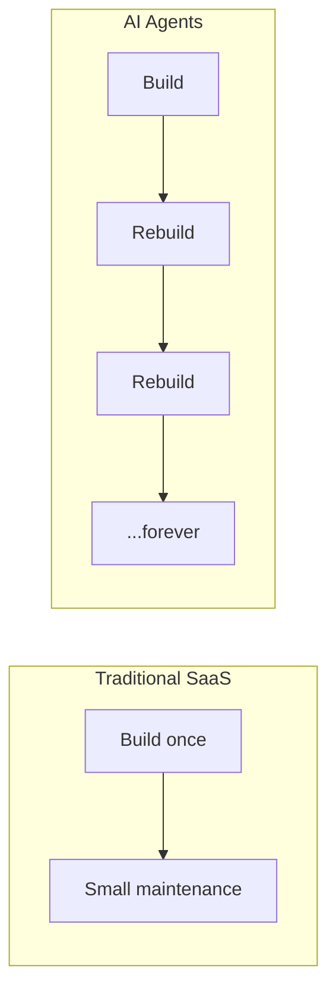

# Buy vs Build, Build, Build (Lorikeet)

Lorikeet's argument (a CX-agent vendor — they sell the buy side, so weigh the
self-interest): with AI agents the classic build-vs-buy math **breaks**, because
the models, architectures, and expectations keep changing. It's not "build vs buy,"
it's **"build, build, build, build, build vs buy."**

## Why the math is different

Traditional SaaS gave a clean choice: **upfront build cost + small maintenance**,
versus an **ongoing fee** somewhere between. That assumed the thing you built stays
built.

With agents, staying competitive means **continuous heavy investment and willing
full rebuilds** as the tech and consumer expectations move. Building risks either
**cost blowouts** or **falling behind** — a permanent team "forever rebuilding to
keep pace."

## Why it matters

The real cost of building isn't the build — it's the **opportunity cost**: "what
else those engineers could be building." The honest question shifts from *"can we
afford to build it?"* to *"do we want to own it forever?"* Even discounting the
vendor's obvious incentive, the opportunity-cost point stands and reframes the whole
[build vs buy](build-vs-buy.md) decision for fast-moving agentic systems. The
resolution most sources converge on is not all-or-nothing but **per-layer** — see
[split the stack](split-the-stack-ai-agents.md).

## Related

- [Build vs Buy](build-vs-buy.md) — the synthesized decision this sharpens.
- [Build or Buy AI Agents (Marr)](build-or-buy-ai-agents-marr.md) — the strategic framing.
- [Split the Stack (Appelo)](split-the-stack-ai-agents.md) — where to draw the own/rent line.

## References
- [With AI agents, it's not buy vs build. It's buy vs build, build, build, build, build — Lorikeet](https://www.lorikeetcx.ai/blog/with-ai-agents-its-not-buy-vs-build-its-buy-vs-build-build-build-build-build)
