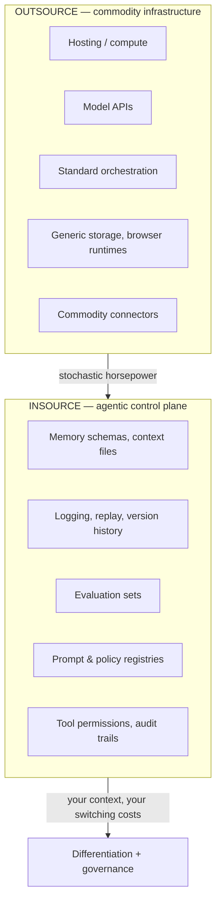

# Split the Stack — Building vs Buying AI Agents

Jurgen Appelo's resolution to the [build vs buy](build-vs-buy.md) debate: stop
asking it at the *company* level. **Split the stack in two** and decide per layer.
Rent the commodity plumbing; own the control plane where your organization's memory,
differentiation, and compliance live.

## The two layers

Vendors are good at commodity infrastructure because they spread costs across many
customers (consistent with DORA's platform findings). But the **control plane** —
memory, context rules, logging, version history, eval sets, tool permissions —
determines what your agents *know*, how they *behave*, what you can *audit*, and
whether you can *move later*. That's the part to own (echoing the NIST Generative AI
Profile's push to keep evaluation, provenance, and monitoring in-house).

## Three questions before outsourcing a layer

1. **Observability** — can you see what happens inside this layer when it fails? If
   no: own it, or wrap it with your own logging and replay.
2. **Portability** — can you migrate the accumulated knowledge out in under 30 days?
   If no: own it, or keep a portable mirror outside the vendor.
3. **Provenance** — does a regulator, customer, auditor, or risk function require
   control of this layer? If yes: own it.

"Own" doesn't mean bare metal in a basement — it means you control the **logic, the
data, and the portability**, even while renting the compute.

## Why it matters

Split-the-stack cuts through the standoff between "buy is responsible" and "build,
build, build." Both are right about *different layers*. It directly answers the
ownership-cost worry in [buy vs build, build, build](buy-vs-build-build-build.md):
you don't forever-rebuild the plumbing (rented) — you invest only in the control
plane, which is exactly where lock-in, diagnosis, and compliance concentrate.
"Rent the compute. Keep the receipts."

## Related

- [Build vs Buy](build-vs-buy.md) — this is the per-layer resolution of it.
- [Buy vs Build, Build, Build (Lorikeet)](buy-vs-build-build-build.md) — the cost worry this answers.
- [Build vs Buy — Hidden Cost of No-Code UI](build-vs-buy-hidden-cost-no-code-ui.md) — code vs clicks at the workflow layer.

## References
- [Building versus Buying AI Agents: Split Your Stack! — Jurgen Appelo, The Solo Chief](https://substack.jurgenappelo.com/p/building-versus-buying-ai-agents)
