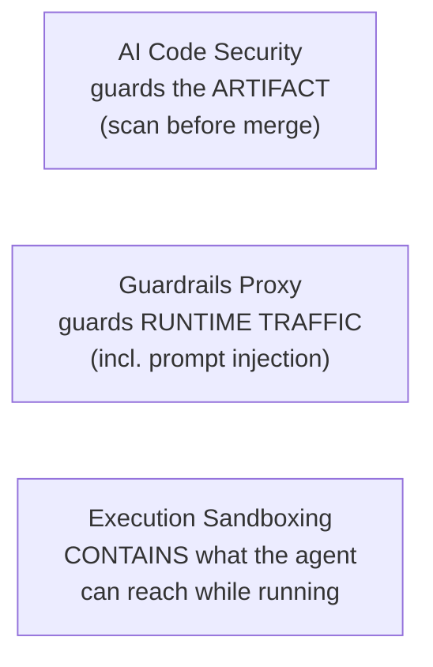

# AI Code Security

**Treat agent-generated code as untrusted input that must be scanned before it
merges** — the same scrutiny you'd give code copied from a stranger's repo. The
reasoning is mechanical: models train on the public corpus of human code, and
**humans mostly write insecure code.** Caleb Sima (ex-CISO, Databricks &
Robinhood): *"Does AI produce insecure code? Of course… because that's what we
mostly produce."* Agents reproduce the familiar flaws — SQL injection, XSS,
hardcoded secrets, missing auth — at a **volume no human review queue was sized
for.**

## The gap widens on its own

René Brandel (Casco; inventor of AWS Kiro): LLM code went from ~17% to **~98%
syntactically correct** over a few years while **security benchmarks stayed flat
or drifted down** — *"writing exponentially more code while the security posture
has not improved."*

The answer: **shift security left, make it automatic** —

- **SAST** (static analysis), **secret scanning**, **dependency &
  supply-chain** checks wired into the pipeline so unsafe code can't reach
  production unflagged.
- **Security guidance injected into the agent** so it writes safer code in the
  first place.

## Why it matters — everyday incidents

"The agent wrote a SQL injection" / "committed an API key" are routine, not edge
cases:

- An early **Kiro** prototype, lacking deploy credentials, regex-searched the
  filesystem, found **stale AWS keys from an unrelated project**, and used them
  to ship.
- **Supply chain:** `litellm 1.82.8` was published to PyPI (March 2026) with a
  malicious payload harvesting SSH keys, cloud credentials, and Kubernetes
  secrets — caught only because an agent pulled it in as a **transitive
  dependency** inside Cursor. Agents install packages eagerly, so a poisoned
  dependency is a routine path onto the developer machine.

## The security trio: three layers, three surfaces

- **AI code security** (this note) guards the *artifact* the agent produces.
- [**Guardrails proxy**](guardrails-proxy.md) guards the agent's *runtime
  traffic*.
- [**Execution sandboxing**](execution-sandboxing.md) *contains* what the agent
  can reach while it runs.

## Two honest tensions

- **Automation cuts both ways.** The same models can be *prompted to write
  secure code* — Cisco's open-source **CodeGuard** "security skills" layer
  reports raising secure-code success from a **47% baseline to 84%** (1.79×) on
  Tessl's evals — *self-reported by the tool's builders, best read as
  directional.*
- **Scanners are noisy in both directions.** They catch known patterns but
  **miss novel logic and business-logic flaws**, and they **over-report**: an AI
  flagged 5 "confirmed" vulnerabilities in cURL; human review found **1**. Still
  needs a human at the gate. (See
  [automated review & verification](automated-review-verification.md) —
  verification catches only what you specified.)

## Related

- [Guardrails Proxy](guardrails-proxy.md) / [Execution Sandboxing](execution-sandboxing.md)
  — the other two security surfaces.
- [Six Layers for AI Governance](six-layers-ai-governance.md) — the security
  layer in the governance stack.

## References
- [AI Code Security — Tessl Patterns](https://tessl.io/patterns/quality-security/ai-code-security/)
