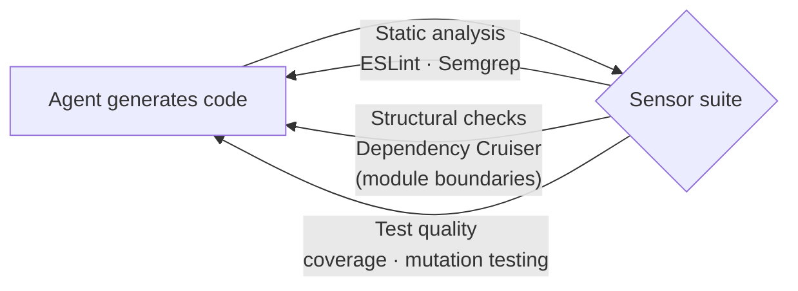

# AI Coding Sensors (Böckeler / Thoughtworks)

Birgitta Böckeler's Thoughtworks piece is the source of the **feed-forward vs
feedback** split that [Harness Engineering (Sensors & Simulators)](harness-engineering.md)
builds on, and it grounds the abstract idea of a "sensor" in a concrete
experiment.

The outer harness has two halves:

- **Feed-forward** — context pushed in *up front*: skills, conventions,
  guardrails, `AGENTS.md`.
- **Feedback** — tooling that *observes what the agent produced* so it can
  self-correct before a human ever looks. Sensors are the feedback half.

A **sensor** is a static check that *reads* code without running it and returns a
mostly deterministic signal the model's own judgment can't provide. (Contrast
with a *simulator*, which runs the code — see
[harness-engineering](harness-engineering.md).) This is the same feedback
surface that [loop engineering](loop-engineering.md) and the
[self-improving harness loop](self-improving-harness-loop.md) close around.

## The experiment: sensors in action

On a TypeScript data-dashboard build, Thoughtworks ran a coding agent *with* and
*without* a suite of sensors:

The finding: **with sensors wired into the loop, the agent improved quality over
time** — e.g. it raised test coverage on its own — because each sensor gave it a
concrete, machine-checkable signal to act on. Without them it had nothing to
push against. This is the empirical case for the calibration point in the
harness literature: *sensors only help if they encode your standards, and agents
don't learn by osmosis.*

## References
- [Harness engineering and agent feedback: Exploring AI coding sensors — Birgitta Böckeler, Thoughtworks](https://www.thoughtworks.com/en-us/insights/blog/generative-ai/harness-engineering-agent-feedback-exploring-ai-coding-sensors)
