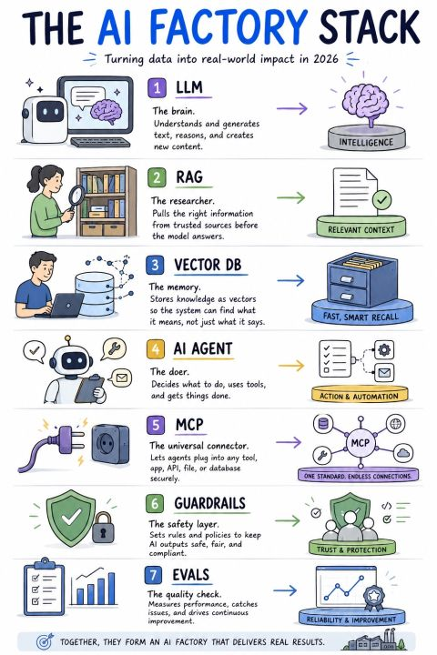

# The AI Factory Stack

A seven-part stack for "turning data into real-world impact in 2026," each part with a
one-word role.

1. **LLM** — *the brain.* Understands and generates text, reasons, creates content → intelligence.
2. **RAG** — *the researcher.* Pulls the right information from trusted sources before the model answers → relevant context.
3. **Vector DB** — *the memory.* Stores knowledge as vectors so the system finds what it means, not just what it says → fast, smart recall.
4. **AI Agent** — *the doer.* Decides what to do, uses tools, gets things done → action & automation.
5. **MCP** — *the universal connector.* Lets agents plug into any tool, app, API, file, or database securely → one standard, endless connections.
6. **Guardrails** — *the safety layer.* Sets rules and policies to keep AI outputs safe, fair, compliant → trust & protection.
7. **Evals** — *the quality check.* Measures performance, catches issues, drives continuous improvement → reliability & improvement.

Together they form an "AI factory" that delivers real results.

## Cross-links

A compact, role-per-component version of [Agentic Engineering Stack](agentic-engineering-stack.md)
and [AI Harness Architecture](ai-harness-architecture.md). Guardrails + Evals are the
verification/operations layers of [Agent Harness Engineering](agent-harness-engineering.md);
MCP is detailed in [Model Context Protocol (MCP) Architecture](mcp-architecture.md).

## References

- 
