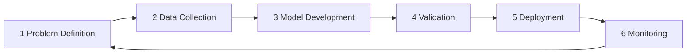

# AI Governance by Design

A six-stage lifecycle cycle (consulting-report style) around the principle **"governance
must be built in, not added on."**

1. **Problem Definition** — is the use case appropriate? what are the social and
   business risks?
2. **Data Collection** — consent and privacy checks; data quality and representativeness.
3. **Model Development** — bias testing, documentation, explainability considerations.
4. **Validation** — performance review, fairness checks, security testing.
5. **Deployment** — approval gates, human oversight, usage restrictions.
6. **Monitoring** — drift detection, incident management, retraining decisions.

**Key principle:** move governance upstream — before risk becomes harm.

## The lifecycle

## Cross-links

The lifecycle-process view of governance, complementing the layered
[Six Layers for AI Governance](six-layers-ai-governance.md) and the architectural stance
of [Intelligence From Architecture (IFA)](intelligence-from-architecture-ifa.md). Stages
4–6 (validation, oversight, monitoring) are the verification/operations concerns in
[Agent Harness Engineering](agent-harness-engineering.md).
