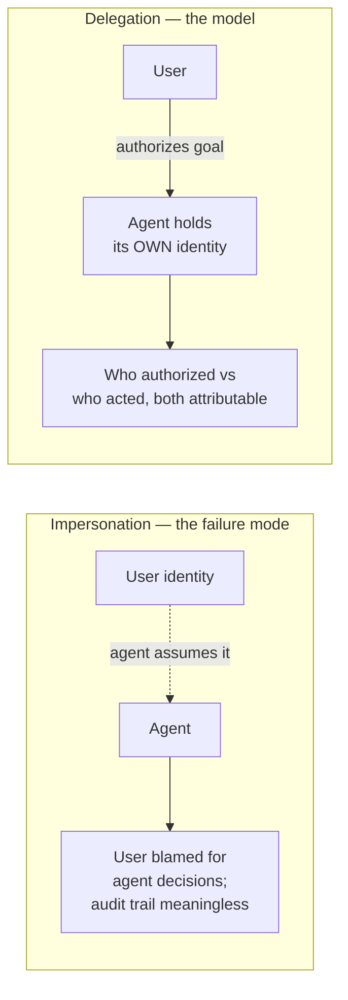

# Agent Identity & Access

Giving **every agent its own identity and tightly scoped permissions** —
answering not just *"can this call happen"* but *"who authorized the goal, and
who implemented it."* Raghvender Arni: *"Identity with agents isn't just
authentication — it's accountability."*

## Impersonation → delegation

The failure mode it prevents is **impersonation**: an agent that simply assumes
a user's identity — which leaves the user **blamed for autonomous decisions** and
the audit trail meaningless. The emerging model is **delegation**: the agent
holds its *own* identity while acting on a user's behalf.

Mechanisms: **OAuth Token Exchange (RFC 8693)** actor tokens; asynchronous
**human approval (OIDC CIBA)** for high-risk actions.

## Non-human identity done right

Operationally:

- **Workload identity + secretless auth** — agents never hold long-lived keys.
- **Scoped tokens per task.**
- **SSO + audit integration** — every action attributable.

## Why it matters

As agents move from tools to **autonomous decision-makers**, identity shifts from
*"who clicked"* to *"who authorized versus who acted."* This is the **authn/authz
foundation** that the [guardrails proxy](../ai-platform/guardrails-proxy.md) and
[agent observability](../ai-platform/agent-observability.md) build on — *you cannot police or
audit what you cannot attribute.*

**Honest caveat:** the standards are **early and still settling** (RFC 8693, OIDC
CIBA, emerging agent-identity protocols), so most orgs start with **scoped
impersonation** and grow toward **true delegation**.

## Related

- [Guardrails Proxy](../ai-platform/guardrails-proxy.md) / [Agent Observability](../ai-platform/agent-observability.md)
  — both need attributable identity to enforce and audit.
- [MCP Gateway](../ai-platform/mcp-gateway.md) — agent identity is part of enterprise-ready MCP.
- [Six Layers for AI Governance](six-layers-ai-governance.md) — identity underpins
  the security + oversight layers.

## References
- [Agent Identity & Access — Tessl Patterns](https://tessl.io/patterns/quality-security/agent-identity-access/)
