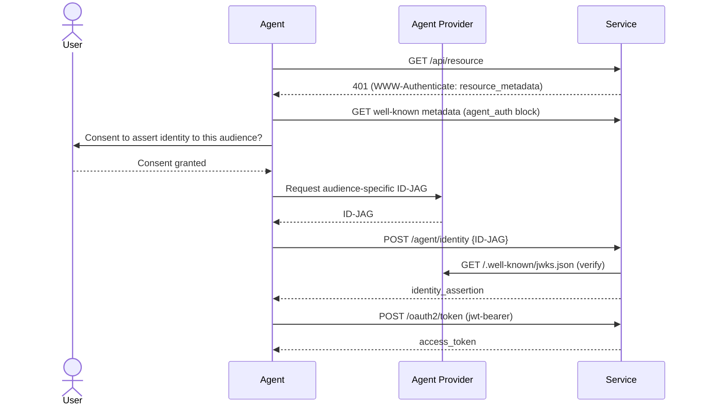

# auth.md: Agentic Registration

`auth.md` (WorkOS) is a reference implementation of **agentic registration** — an
open protocol that lets **agents authenticate to services on behalf of users**,
discoverable through a Markdown file (`AUTH.md`) hosted at the service's domain. It
extends the least-privilege, verifiable-identity posture in
[agent identity & access](agent-identity-access.md) with a concrete wire protocol.

## Three roles

- **Agent** — acting for a user.
- **Agent provider (IdP)** — mints **identity assertions** as ID-JAGs
  (*ID JWT Authorization Grants*, an OAuth draft) and publishes a JWKS for
  verification.
- **Service** — accepts those assertions when available and issues credentials
  (access tokens). If the agent has **no** associated user identity, or the provider
  doesn't support ID-JAGs, the service falls back to an **RFC 8628-style claim
  ceremony** (device-code style) to authenticate the agent instead.

The `AUTH.md` file itself is a **skill manifest agents read** — a procedural recipe:
*discover → register → claim → exchange → use → handle revoke.*

## Discovery: standard OAuth metadata + an `agent_auth` extension

Hosted at `/.well-known/oauth-authorization-server`. The top-level fields
(`issuer`, `token_endpoint`, `revocation_endpoint`, `grant_types_supported`) are
standard RFC 8414 / 7009 / 7523. The **`agent_auth` block** is the profile
extension carrying the registration surface: `skill` (the `auth.md` URL),
`identity_endpoint`, `claim_endpoint`, `events_endpoint`, `identity_types_supported`
(`anonymous`, `identity_assertion`, `service_auth`), supported assertion types, and
supported events (e.g. assertion-revoked). Two custom grant types appear:
`urn:ietf:params:oauth:grant-type:jwt-bearer` and
`urn:workos:agent-auth:grant-type:claim`.

Registration and credential issuance split across two endpoints:
`POST /agent/identity` accepts the agent's chosen identity assertion and returns a
service-signed `identity_assertion`; the agent then exchanges that at
`POST /oauth2/token` (RFC 7523 JWT-bearer grant) for an `access_token`.

## The three flows

**1. Identity assertion (ID-JAG)** — the agent has a user-linked identity:

**2. Verified-email identity assertion** (`service_auth`) — no provider IdP: the
service issues a `claim_token` with a `user_code` + `verification_uri`; the agent
surfaces those to the user, who signs in and completes the claim; the agent polls
`/oauth2/token` with `grant_type=claim` until it gets an `access_token`
(device-code-style, with `authorization_pending` and `expired_token` handling).

**3. Anonymous** — an agent with no user identity registers anonymously.

Revocation is event-driven: the provider sends revocation events (e.g.
`.../identity/assertion/revoked`) to the service's `events_endpoint`.

## Related

- [Agent identity & access](agent-identity-access.md) — the identity/least-privilege principles this protocol implements.
- [Code provenance is non-negotiable in the age of AI](code-provenance-non-negotiable.md) — tying machine identity to accountability.

## References
- [auth.md — WorkOS (GitHub)](https://github.com/workos/auth.md)
