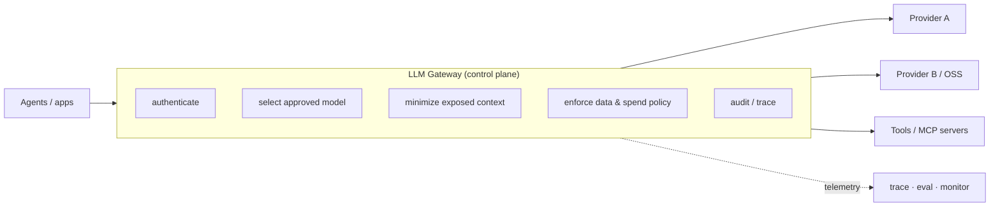

# Building Governed Agents: A Framework for Cost, Control, and Compliance

Martha Janicki (LangChain) argues that as agents become **production infrastructure**, an
**LLM gateway** must be the **runtime control plane** — turning policy into enforceable
decisions on every model call, tool call, and agent hop. It's the LangSmith LLM Gateway
pitch, but the framework generalizes.

## Why governance now

Three drivers push governance from paperwork to runtime enforcement:

1. **Cost** — agent workloads burn far more tokens; AI spend gets hard to predict.
2. **Continuity** — business-critical agents carry uptime requirements prototypes never had.
3. **Regulation** — privacy/security/AI rules require proving policies are *applied
   consistently*, not merely that they *exist* (e.g. the [EU AI Act's](ai-regulation.md)
   risk categories; material penalties for noncompliance).

Plus a **diversifying model market**: frontier models get more capable and pricier while
open-source narrows the gap (especially with a tuned harness) at a fraction of the cost.
Enterprises must govern a *portfolio* — which models are permitted, for which tasks,
balancing quality/cost/latency/risk.

## The gateway as runtime control plane

A single place to authenticate usage, select approved models, minimize exposed context,
and enforce data + spending policy. Its strategic value: it **decouples applications from
model volatility** while preserving control as providers, prices, and capabilities change.
*Governance shouldn't lock you into today's models — it should make change safer.*

## What needs to be governed

Different interaction types carry different risk. For agents, the biggest risk is often
**not what the model says, but what the agent can *do*** — so governance extends past
content filtering into *action*: which tools, which credentials, when a human must approve.

| Interaction | What's at risk | Governance requirement |
|---|---|---|
| **LLM calls** | Cost, model availability, private data | Spend limits, redaction, provider routing |
| **Tool calls** | Unintended actions in production systems | Permissioning, audit trail |
| **[MCP](../ai/large-language-models.md) calls** | Data leaving your infra boundary | Access control, logging |
| **Agent-to-agent (A2A)** | Compounding errors / unauthorized context across chains | Tracing, policy enforcement *at each hop* |

## Foundations

- **Authentication & identity** — agents *and* their operators authenticate like any
  enterprise system: SSO via SAML/OIDC, just-in-time provisioning. Wiring identity to the
  org IdP makes deprovisioning one action, not a five-tool checklist. (See
  [agent identity & access](agent-identity-access.md).)
- **User management** — RBAC with inherited permissions; SCIM to automate
  provision/update/revoke as people join, move, or leave.
- **Audit logs** — every consequential interaction must be *provable*: who ran it, which
  **policy version** applied, what outcome, which tools/providers. Retention and access
  must preserve the evidence securely.

## Cost & model choice

- **Spend controls** — limits at org / business-unit / team / API-key / user level,
  layered across daily/weekly/monthly windows, with defaults to avoid per-team config.
  One API key per client/workload gives usage tracking and caps for free.
- **Model routing = portfolio management** — not just "cheap model for easy prompts," but
  matching each task to a model *approved for that use case* meeting quality/latency/cost/
  risk bars. Small/specialized models for routing/classification; capable models reserved
  for deep reasoning.

## Protecting sensitive data at runtime

For those under a compliance framework, data protection is what saves you in an inspection
or breach disclosure. Relevant regimes: **CCPA** (California; know/delete/opt-out),
**GDPR** (EU; lawful basis + access/correct/delete rights), **EU AI Act** (risk-tiered
obligations: transparency, human oversight, documentation), **HIPAA** (US PHI; safeguards
+ Business Associate Agreements). (More: [data governance](data-governance.md),
[AI regulation](ai-regulation.md).)

**Guardrails** are logic layers detecting whether a pattern is present in a request:

- **Pattern-based** (regex) — good for fixed formats: SSNs, phone numbers, structured PII.
- **Model-based** (NER / classifiers) — for context-dependent cases: names, locations,
  affiliations, plus prompt injection, jailbreaks, ungrounded output — which look
  different every time.

Guardrails *reduce* risk, don't eliminate it: pattern controls miss unfamiliar formats;
model detection is probabilistic (false positives and negatives). So reinforce them with
**deterministic data/tool boundaries** — consequential actions should hinge on hard limits
or human approval, not content detection alone. (Related: [OWASP LLM Top 10](owasp-llm-top-10.md).)

## Reliability under production load

The gateway sits in the critical path, so it must not become a single point of failure:

- **Fallbacks** — on outage/deprecation/rate-limit, either fail outright or fail over. A
  backup model is valid only when **policy-equivalent** (same data-handling, residency,
  safety guarantees).
- **Rate limits & alerts** — enforce limits in the gateway (reroute before hitting provider
  caps); recurring limit-hits signal an unhealthy agent. Notify teams as thresholds
  approach.
- **Resilience** — timeouts, load balancing, and explicit **fail-open / fail-closed**
  behavior chosen by workload risk.

## Takeaway

Governance can no longer be per-team approvals bolted on separately. The gateway is the
shared runtime layer for model access, context, spend, failures, and policy. Connect its
decisions to **tracing, evaluation, and monitoring** — govern agents in the *same* place
you observe them — so each model call becomes a governed, observable, continuously
improvable decision.

Related: [six layers of AI governance](six-layers-ai-governance.md) ·
[AI governance by design](ai-governance-by-design.md) ·
[agent identity & access](agent-identity-access.md).

## References
- [Building Governed Agents: A Framework for Cost, Control, and Compliance](https://www.langchain.com/blog/building-governed-agents-a-framework-for-cost-control-and-compliance)
