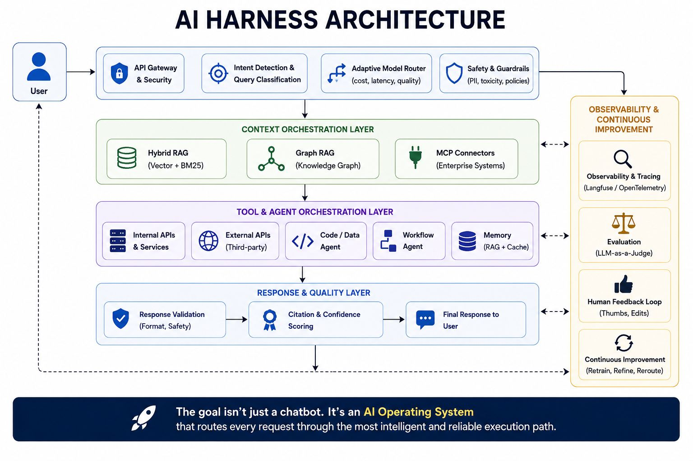

# AI Harness Architecture: The AI Operating System

A layered block diagram framing the harness as an "AI Operating System" that routes
every request through the most intelligent, reliable execution path — not just a chatbot.

User request enters a top band of **API Gateway & Security**, **Intent Detection & Query
Classification**, **Adaptive Model Router** (cost/latency/quality), and **Safety &
Guardrails** (PII, toxicity, policies), then flows down three layers:

1. **Context Orchestration Layer** — Hybrid RAG (Vector + BM25), Graph RAG (knowledge
   graph), MCP connectors (enterprise systems).
2. **Tool & Agent Orchestration Layer** — internal APIs & services, external APIs, a
   code/data agent, a workflow agent, memory (RAG + cache).
3. **Response & Quality Layer** — response validation (format, safety), citation &
   confidence scoring, final response to user.

A right-hand **Observability & Continuous Improvement** column runs alongside all layers:
observability & tracing (Langfuse/OpenTelemetry), evaluation (LLM-as-a-Judge), human
feedback loop (thumbs, edits), continuous improvement (retrain, refine, reroute).

## Cross-links

The same five concerns as [Agent Harness Engineering](agent-harness-engineering.md)
(orchestration, context, tools, verification/response-quality, operations) and a close
sibling of the [Agentic Engineering Stack](agentic-engineering-stack.md) and
[Agentic Engineering Core](agentic-engineering-core.md). The "AI Operating System"
framing is the same one in [What Is Agent Harness Engineering?](agent-harness-engineering.md)
(model=CPU, harness=OS).

## References

- 
