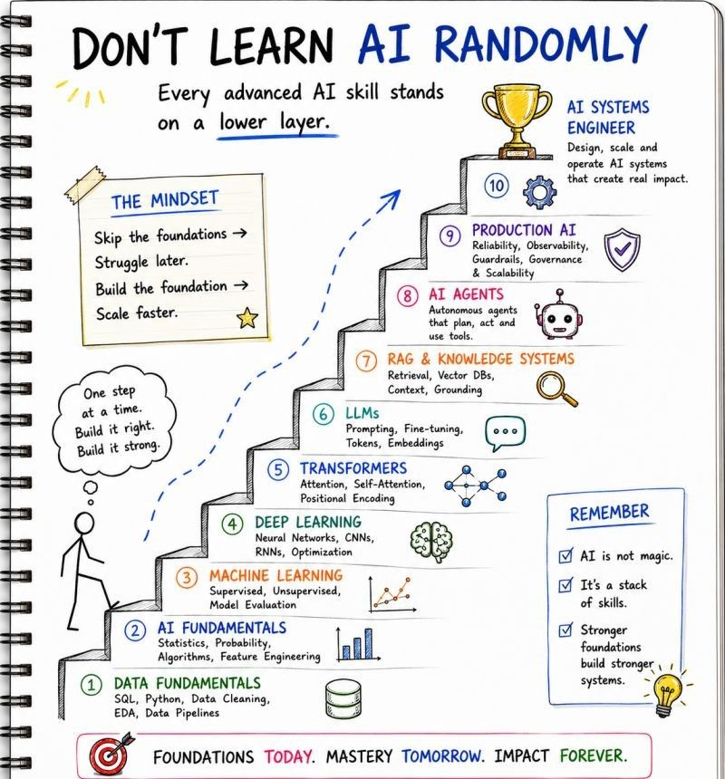

# The AI Learning Ladder

A hand-drawn roadmap arguing that every advanced AI skill stands on a lower layer:
skip the foundations and you struggle later; build them and you scale faster. Learn
the layers in order, bottom to top.

## The mindset

- Skip the foundations → struggle later.
- Build the foundation → scale faster.
- One step at a time. Build it right, build it strong.

## The ten layers (foundation → mastery)

| # | Layer | Covers |
|---|-------|--------|
| 1 | Data Fundamentals | SQL, Python, data cleaning, EDA, data pipelines |
| 2 | AI Fundamentals | Statistics, probability, algorithms, feature engineering |
| 3 | Machine Learning | Supervised, unsupervised, model evaluation |
| 4 | Deep Learning | Neural networks, CNNs, RNNs, optimization |
| 5 | Transformers | Attention, self-attention, positional encoding |
| 6 | LLMs | Prompting, fine-tuning, tokens, embeddings |
| 7 | RAG & Knowledge Systems | Retrieval, vector DBs, context, grounding |
| 8 | AI Agents | Autonomous agents that plan, act, and use tools |
| 9 | Production AI | Reliability, observability, guardrails, governance, scalability |
| 10 | AI Systems Engineer | Design, scale, and operate AI systems that create real impact |

## Remember

- AI is not magic.
- It's a stack of skills.
- Stronger foundations build stronger systems.

> Foundations today. Mastery tomorrow. Impact forever.

## References

- 
