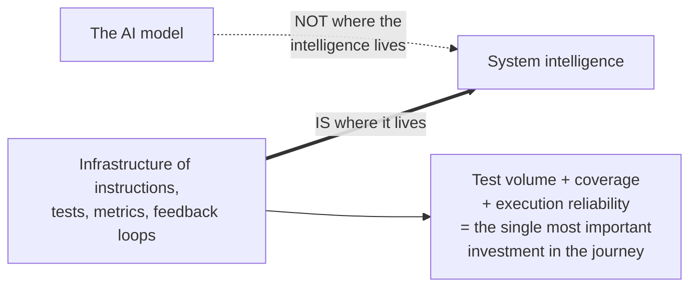

# Agentic Maturity Models

A **staged framework** for locating where an org *actually* sits on the path
from ad-hoc, individual AI use to **agent-native delivery** — so investment and
measurement match reality. It names the stages so leaders can tell the
difference between **a few enthusiastic power users** and an org that has
**genuinely changed how it builds.**

## Most models borrow an existing ladder

- **Sourcegraph "levels of code AI"** — six steps modelled on **SAE self-driving
  levels**: human-initiated assistance → AI-initiated work → AI-led code (AI
  designs architecture, writes production code, handles deployment; human only
  validates).
- **AI Codebase Maturity Model (ACMM)** — inspired by **CMMI**, defines each
  level by its **feedback-loop topology** — "the specific mechanisms that must
  exist before the next level becomes possible."

Both share one claim: **stages are ordered — you cannot skip levels.**

## The load-bearing insight: capability lives in the infrastructure

ACMM's central finding: *"the intelligence of an AI-driven development system
resides **not in the AI model itself**, but in the infrastructure of
instructions, tests, metrics, and feedback loops that surround it"* — with
**test volume, coverage, and execution reliability** the single most important
investment. So a maturity model is less a scorecard for the model and more a
**map of the surrounding [pipeline](../ai-platform/ai-sdlc.md), [evals](../ai-platform/evals-llm-as-a-judge.md),
and [context](../harness-engineering/context-engineering.md).**

## Why it matters: honesty and pacing

- **Pace metrics to the stage.** Early: track adoption and enablement. Later:
  track delivery and autonomy. Measuring for autonomy before the foundations
  exist just produces **noise.**
- **Don't skip stages.** Chasing the [dark factory](../harness-engineering/dark-factory.md) before the
  pipeline can tame it **automates chaos** rather than removing it.
- **Disciplines the metrics conversation.** Self-reported numbers exist (ACMM
  reference: 91% coverage, <30-min bug-to-fix, 5× PR / 37× issue throughput
  L2→L6) — but from a **single experience report, not a controlled study** —
  directional. A model reporting high adoption **without naming what unlocked
  it** tells you little (the 93%-adoption org got there via
  [engineers-train-engineers onboarding](driving-adoption.md), not tool
  handouts).

**Honest caveat:** a stage label can **flatter you.** Personal productivity
doesn't automatically become organizational productivity — Borg (110-person org):
when coding and review time collapse, *"the bottleneck just moves to the
backlog."*

## Related

- [The AI SDLC](../ai-platform/ai-sdlc.md) — the pipeline a maturity model actually maps.
- [Driving Adoption](driving-adoption.md) — early-stage work; adoption % means
  little without the mechanism.
- [The Autonomy Ladder](../harness-engineering/autonomy-ladder.md) / [Dark Factory](../harness-engineering/dark-factory.md) —
  the top of the maturity path.

## References
- [Agentic Maturity Models — Tessl Patterns](https://tessl.io/patterns/scaling-the-org/agentic-maturity-models/)
