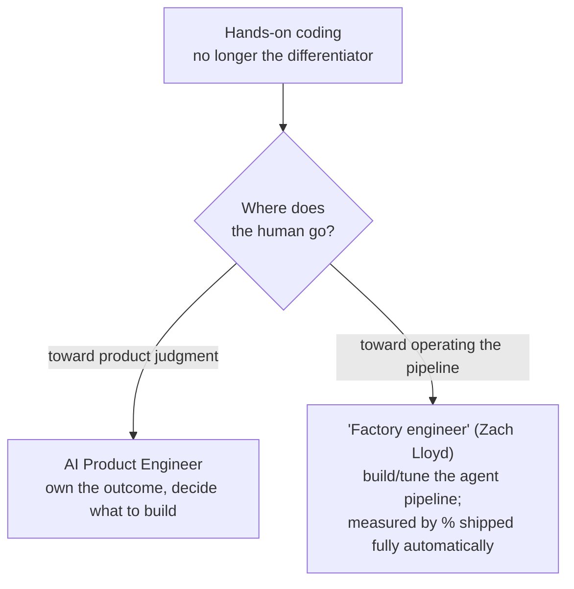

# The AI Product Engineer

As writing code gets cheap, the scarce skill moves to **deciding *what* to
build.** The AI product engineer **owns the outcome, not just the
implementation** — where a software engineer owns *code quality*, a product
engineer owns the *result*: idea → shipped feature with minimal handoff, in
**direct contact with the user's problem.** Foxwell: *"I've never seen a dev team
get to the end of their backlog… I've seen it now. More than once."*

## A deliberate blend

Against a decade of hyperspecialization (frontend / backend / DevOps), it's **one
person spanning design, technical, and business** — builders who "first seek to
understand the problem before diving into solutions" (Product Engineer
Manifesto). Leading labs hire exactly this: Anthropic's *Product Engineer,
Computer Use* — "own end-to-end delivery… no layers between you and the model or
the user." As engineers spend more time **specifying**, they drift into what was
the PM's job.

It sits in a cluster of rebalanced-around-agents roles, beside its close cousin
the [forward-deployed engineer](forward-deployed-engineer.md) — "sits side by
side with users," fixes the product directly on spotting a gap: the same
discovery instinct from the engineering side, closer to a field CTO than a sales
engineer.

## Discovery is part of the job

Figuring out **what's worth building**, not just building it. This is where
[vibe coding](../agentic-coding/vibe-coding.md) earns its keep — throwaway prototypes to feel out
the problem before committing.

## Why it matters: taste is the scarce skill

When **any function can be generated on demand**, differentiation no longer comes
from *writing* it — it comes from knowing **which** function the business needs,
what "good" looks like, and increasingly **what *not* to build.** Faster delivery
drains the backlog and tips risk toward **feature bloat** — everything you add is
something you then maintain. So the scarce discipline is **product taste: the
judgment to say no.** (The "knowing good from bad" skill from
[comprehension debt](comprehension-debt.md), pointed at the product.)

## The contested trajectory

Both camps agree hands-on coding is no longer the differentiator; they **disagree
on where the human goes next** — toward product judgment, or toward operating the
[dark factory](../harness-engineering/dark-factory.md). And "product engineer" stays a **loosely
defined, sometimes aspirational** title — on a small team it can quietly become
product, design, and QA at once.

## Related

- [From Coder to Orchestrator](from-coder-to-orchestrator.md) — the role's
  product-owner facet, made a title.
- [The Rise of the Forward Deployed Engineer](forward-deployed-engineer.md) — the
  close cousin, discovery from the field.
- [Vibe Coding](../agentic-coding/vibe-coding.md) — the discovery tool this role leans on.

## References
- [The AI Product Engineer — Tessl Patterns](https://tessl.io/patterns/changing-roles/ai-product-engineer/)
