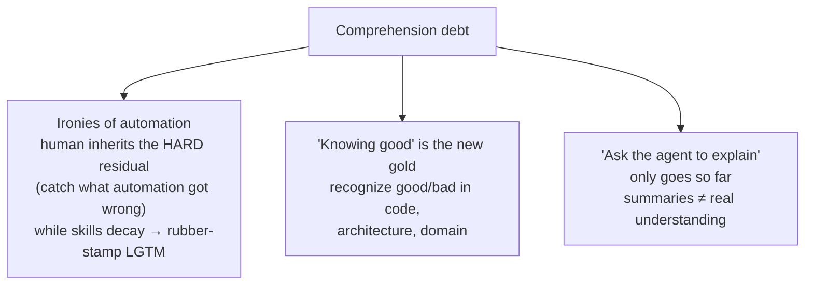

# Comprehension Debt

**The gap between code that *exists* in your codebase and code anyone actually
*understands*.** As agents generate faster than humans can read, **understanding
— not typing — becomes the bottleneck**, and the debt **compounds:** each
unreviewed change raises the cost of the next. Osmani: *"AI writes faster,
people understand less, the gap grows."*

Unlike technical debt (slow builds, tangled deps), comprehension debt breeds
**false confidence** — the codebase looks clean, tests pass, and the reckoning
arrives quietly at the worst moment. Reports put the generate-vs-read gap around
**5–7×**; and as you [orchestrate rather than author](from-coder-to-orchestrator.md),
the understanding that used to come *free* from typing stops arriving — someone
else did the work. A student team hit the wall in **week seven**: unable to
change anything without breaking something.

## Invisible to the dashboard

Velocity, DORA, PR counts, and coverage all look **immaculate** while a team's
grasp of its own systems hollows out. Three consequences:

- **It's the ironies of automation** (Bainbridge). Automate the easy parts, the
  human inherits the *hard* residual — catching what automation got wrong — while
  their skills **decay from disuse.** Failure mode = the **rubber stamp**: *LGTM*
  on a diff no one read. Anthropic RCT (52 engineers): AI-leaning developers
  scored **17% lower** on a comprehension quiz, **worst in debugging** — the
  skill you need most when AI code breaks — and passive "just make it work"
  delegation hurt far more than active, question-driven use.
- **Knowing what "good" looks like is the new gold.** The scarce skill isn't
  producing code but **recognizing good from bad** — in the *code*, the
  *architecture* (does it fit?), and the *domain* (is it what the business
  needs?). Exactly the judgment [vibe coding](../agentic-coding/vibe-coding.md) sets aside — which
  is why it shines for prototypes and slides into debt once output must be
  maintained. Must be **trained and kept current** — most of all for the moment
  something fails and you must debug a system you only ever *supervised*.
- **"Just ask the agent to explain it" only goes so far.** Agents summarize the
  meaningful decisions in a change, but a summary isn't the durable
  understanding you need when it breaks.

## The through-line

Comprehension debt is the cost that [collaborating with agents](../agentic-coding/collaborating-with-agents.md)
routes around (hand off only what's clear and low-risk) and that
[evals](../ai-platform/evals-llm-as-a-judge.md) and reviewed, understood
[spec-driven work](../agentic-coding/spec-driven-development.md) pay down. The antidote is
**active, question-driven** use over passive delegation — read the diff, keep the
judgment trained.

## Related

- [From Coder to Orchestrator](from-coder-to-orchestrator.md) — the shift that
  stops understanding arriving for free.
- [Collaborating with Agents](../agentic-coding/collaborating-with-agents.md) — matching mode to
  clarity is how you avoid unchosen debt.
- [Vibe Coding](../agentic-coding/vibe-coding.md) — the deliberate surrender of comprehension;
  fine until it must be maintained.

## References
- [Comprehension Debt — Tessl Patterns](https://tessl.io/patterns/changing-roles/comprehension-debt/)
