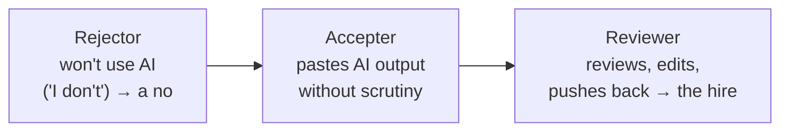

# How to Hire Engineers Who Use AI

A recruiter-side (KORE1) screening guide for 2026. The thesis: hiring engineers now means
screening for **how candidates review and edit AI-generated code — not whether they can
write every line from memory.** The strongest single signal is a candidate who **pushes
back on AI output** rather than one who pastes it.

The guide reports this as a **hiring-criteria reset, not a trend** — three hiring managers
across three verticals (backend, frontend, healthcare IT), who don't know each other,
converged independently on the same criterion in the same three-week window:

- "peer review, edit AI-generated code, right? That's what I actually need them doing."
- "how are they using AI today? Because if the answer is 'I don't,' that's a no for me" —
  even for someone who wrote the exact codebase being hired against.
- "professional, hungry, humble, leans into AI."

## Three reviewer profiles

The guide sorts candidates by how they handle AI output, and argues the right
phone-screen question surfaces the difference in about five minutes:

The reqs (job descriptions) that don't reflect this reset are screening for the wrong
thing. This is the staffing-industry echo of the same "how are they using AI today? If
the answer is 'I don't', that's a no" signal quoted in
[Hiring in the AI Era](hiring-in-the-ai-era.md) — the ability to tell good AI output from
bad is exactly the scarce skill being screened for.

## Related

- [Hiring in the AI Era](hiring-in-the-ai-era.md) — the general pattern; shares the
  "pushes back on AI output" signal verbatim.
- [Canva: Yes, You Can Use AI in Our Interviews](canva-ai-in-interviews.md) and
  [Meta's AI-Enabled Coding Interview](meta-ai-enabled-coding-interview.md) — employers
  building this reviewer-profile screen into the interview itself.
- [Software Engineer Interviews for the Age of AI](interviews-for-the-age-of-ai.md) —
  ownership and system-design probes for the same trait.

## References
- [How to Hire Engineers Who Use AI in 2026: Screening Guide — KORE1](https://www.kore1.com/hire-engineers-who-use-ai)
