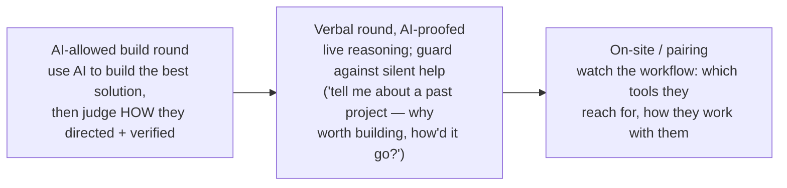

# Hiring in the AI Era

When anyone can produce plausible code with an agent, the **closed-book coding
screen stops predicting much** — it tests the thing that's now automated. Hiring
shifts toward what agents **don't** supply: judgment, systems thinking, debugging
under uncertainty, clear communication, and the **taste to tell genuinely good
output from output that merely looks right.**

You're hiring an **integrator and systems thinker, not an ML researcher** — so
**name the role precisely** (*agentic coder*, *AI product engineer*,
*forward-deployed engineer*) or you'll draw
[ML/traditional-AI applicants](agentic-coding-vs-ai-engineering.md) for a job
that's really about wiring models, tools, and systems together.

**Don't police AI out — bring it in.** Meta's "AI-enabled coding" interview:
work in a multi-file codebase with an assistant, graded on problem solving, code
quality, verification, communication. Canva *expects* Copilot/Cursor/Claude use
rather than "fighting this reality." Counter-intuitively, AI availability makes
it **harder** to fake — weak fundamentals surface *faster* the moment a
constraint changes or an edge case is probed.

## A pipeline, not one screen

- **AI-allowed build round** — best solution they can, judged on *how* they
  directed and verified it: "use AI, but understand the code, explain the
  output, test before using, don't prompt your way out."
- **Verbal round, AI-proofed** — live reasoning; don't put the question where a
  model can read it, watch for suspiciously clean answers.
- **On-site / pairing** — see which tools they actually reach for; the part no
  take-home reveals.

## Signals when nobody has twenty years' experience

No one has a decade of agentic-coding experience — everyone's still learning. So
read **proxies for *how* someone works:**

- **Open-source projects** and how openly they share what they learn.
- **Tool maturity (most telling)** — still at completion + chat, or running
  autonomous agents and doing their own
  [harness engineering](../harness-engineering/harness-engineering.md)? *"How are they using AI today?
  If the answer is 'I don't,' that's a no"* — and the strongest signal is a
  candidate who **pushes back** on AI output rather than pasting it.

## The honest tension

These formats are **early and unproven**, and the deepest signals **resist any
single screen.** As titles rise and code volume stops meaning output, the
durable signals — *can this person think in systems, find the bug nobody else
can, and judge what "correct" means* — are the same ones
[performance](rethinking-performance.md) gets measured on later, and no interview
format yet captures them reliably.

## Related

- [Agentic Coding vs AI Engineering](agentic-coding-vs-ai-engineering.md) — name
  the role so you attract integrators, not ML researchers.
- [Harness Engineering](../harness-engineering/harness-engineering.md) — tool maturity = do they build
  their own harness?
- [Comprehension Debt](comprehension-debt.md) — "knowing good from bad" is the
  scarce skill you're screening for.

## References
- [Hiring in the AI Era — Tessl Patterns](https://tessl.io/patterns/changing-roles/hiring-in-the-ai-era/)
