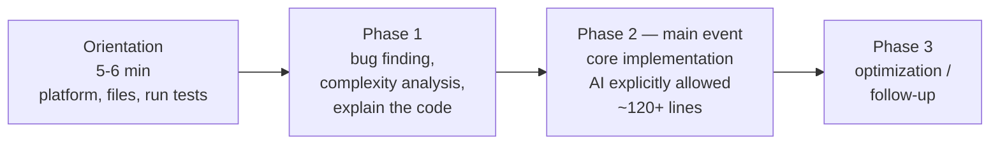

# Meta's AI-Enabled Coding Interview: How to Prepare

Meta piloted a coding interview where an AI assistant is built into the interview
environment and candidates are **expected** to use it. The problems are designed *for*
AI assistance, so the bar is higher than a traditional screen — candidates describe the
core task as harder than a medium LeetCode problem, roughly 120+ lines of code. Written
by Evan King (Hello Interview co-founder, ex-Meta staff engineer) from candidate reports.

## The three phases

One extended problem runs across a single 60-minute session. The interviewer spends the
first 5–6 minutes orienting the candidate to the platform, files, and how to run tests.

After orientation and Phase 1, only ~30 minutes of effective working time remains for
implementation and optimization — time is the most-cited challenge. Candidates who
already recognize the algorithm ("this needs a trie", "BFS with visited tracking") move
faster and reach the optimization step; the optimization catch is often hidden in the
**characteristics of the test data**, not the algorithm.

## How Meta evaluates you

The rubric is **the same four competencies as the traditional coding interview** — it is
not about prompt engineering:

- **Problem Solving** — understand the problem deeply, break it into steps, reason about
  edge cases, pick the right algorithm.
- **Code Quality** — clean, maintainable, efficient, *and you understand what the AI
  generated.* One candidate got negative feedback for appearing to "rely heavily on AI,
  which impacted the quality of their solution."
- **Verification** — run code frequently, check the AI's output before moving on, test
  edge cases. The rhythm they want: **prompt → review → run → confirm → move on.** This
  is one of the clearest positive signals available.
- **Communication** — narrate the process, explain decisions, talk through what the AI
  produced.

## How to prepare

- **Treat the AI as an assistant, not the driver — you lead at all times.** "You should
  be controlling AI, no matter how you use it."
- **Guide with fine-grained prompts.** A successful E5 candidate built the core logic
  first from a single basic function she could review easily, stating intent before each
  prompt and confirming output before moving on.
- **State your approach upfront.** If you already know it's DFS + backtracking, say so —
  interviewers give credit for demonstrated understanding even if the clock runs out.
- **Over-communicate** and know your algorithms cold so recognition is instant.

Counter-intuitively, allowing AI makes weak fundamentals surface *faster* — exactly the
dynamic described in [Hiring in the AI Era](hiring-in-the-ai-era.md). The **verification**
signal here is the same discipline good engineers apply to any AI-generated code.

## Related

- [Hiring in the AI Era](hiring-in-the-ai-era.md) — the general pattern; this is its
  most detailed employer implementation.
- [Canva: Yes, You Can Use AI in Our Interviews](canva-ai-in-interviews.md) — a parallel
  redesign that likewise insists on AI use.
- [Meta Just Transformed Their Coding Interviews with AI](meta-transformed-coding-interviews.md)
  — a developer-facing take on the same pilot.
- [Hiring Engineers Who Use AI](hiring-engineers-who-use-ai.md) — the recruiter-side view.

## References
- [Meta's AI-Enabled Coding Interview: How to Prepare — Hello Interview (Evan King)](https://www.hellointerview.com/blog/meta-ai-enabled-coding)
