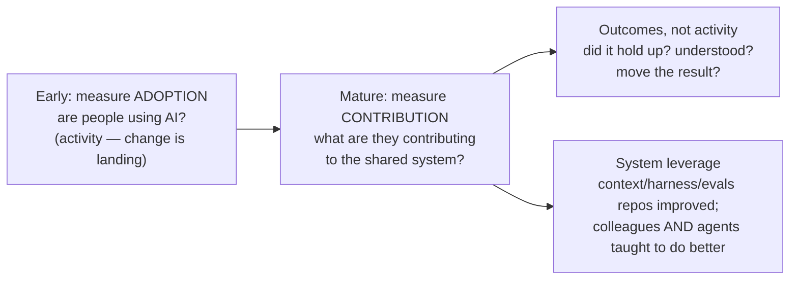

# Rethinking Performance

Once an agent can emit **thousands of lines on command**, output metrics measure
the wrong thing — and PR/commit volume only **inflates** with AI. LeadDev: *"AI
has severed the link between effort and output."* "Lines of code" was always a
poor proxy; volume is now **actively misleading** — Forsgren: *"PRs and diffs are
good signals and are terrible signals."*

The reframe: judge a person on **outcomes and leverage** — problems solved,
quality shipped, and how much they lift the whole system — **not the volume they
emit.**

## Why it matters: counting output rewards churn

A Stanford study (~100,000 developers) found AI raises measured productivity
**~15–20%**, but gross output looks far higher because much of the new volume is
**rework** — bug fixes to code the agent just wrote. **Counting commits rewards
exactly that churn.** (METR's experienced-OSS study is sharper: developers
*believed* +20% while measuring **−19%** — a real perception gap.)

## Adoption → contribution

Measuring **adoption** (are people using AI day-to-day?) is a fine *first*
indicator, but it's still only **activity** — it says nothing about whether
shared context and tooling get reused and improved. Once adoption is real, shift
from *are they using it* to *what are they contributing:*

- **Outcomes, not activity.** Did the work hold up, was it understood, did it
  move the result?
- **System leverage — the force multiplier (and it's countable).** How much do
  they contribute to the shared [context](../harness-engineering/context-engineering.md) and tooling
  repos (`AGENTS.md`, rules, the [harness](../harness-engineering/harness-engineering.md), the
  [evals](../ai-platform/evals-llm-as-a-judge.md)), and improve the system itself — **educating
  both colleagues *and* the agents** to do better? The modern **"10x engineer"
  masters context and amplifies team impact** rather than out-typing everyone.

## The through-line

The durable signals — *think in systems, find the bug nobody else can, judge
what "correct" means* — are exactly what [hiring](hiring-in-the-ai-era.md) tries
to screen for and what [comprehension debt](comprehension-debt.md) erodes when
ignored. Measure those, not the diff.

## Related

- [Hiring in the AI Era](hiring-in-the-ai-era.md) — same durable signals, at the
  front door.
- [Context Engineering](../harness-engineering/context-engineering.md) /
  [Harness Engineering](../harness-engineering/harness-engineering.md) — the shared system that
  "leverage" is measured against.
- [Comprehension Debt](comprehension-debt.md) — what output-chasing quietly
  accrues.

## References
- [Rethinking Performance — Tessl Patterns](https://tessl.io/patterns/changing-roles/rethinking-performance/)
