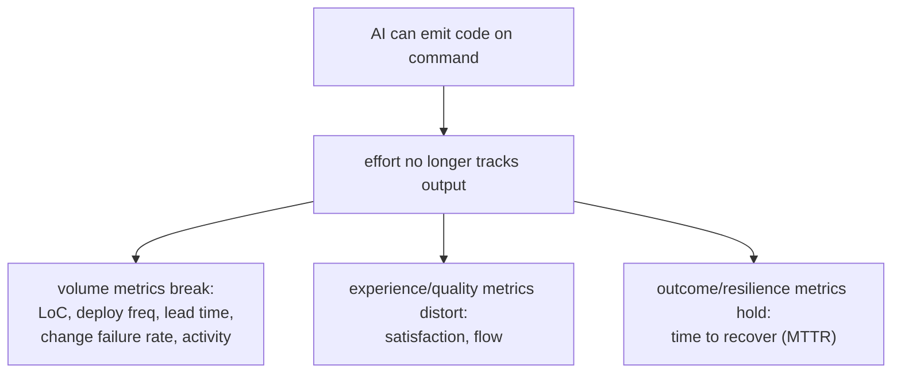

# The 8 Software Engineering Metrics AI Broke

A LeadDev piece by Michael Hill (drawing on practitioners like James Stanier,
Nicholas Arcolano, and Pratik Mistry) cataloguing which engineering metrics
stop meaning what they used to once agents can generate code on demand. The
one-line thesis, worth keeping: **"AI has severed the link between effort and
output."** As Stanier puts it, *"output is now nearly free, so volume measures
the tool and not the engineer — the scarce resource has moved from writing code
to reviewing and shipping it."*

## The metrics AI broke

**Lines of code.** Always discredited (rewards verbosity, punishes deletion),
now fully severed: an agent emits thousands of lines in minutes; AI-generated
code runs ~20% larger on average and correlates mainly with token spend. The
most valuable AI-era work — refactoring, simplifying, deleting slop — scores as
zero or negative.

**The DORA four:**

- **Lead time for changes / cycle time** — collapses when an agent implements
  in minutes, and artificially short times *mask* the real new bottleneck: the
  time a human needs to understand and verify code they didn't write. Short
  cycle time can even signal shipped-without-review and a rising defect escape
  rate.
- **Deployment frequency** — goes up, but what it measures changes from
  *engineering maturity* to *tool adoption*; the two aren't the same.
- **Change failure rate** — still counts failures but can no longer tell you
  *why*: when AI writes and a human approves without full understanding,
  accountability breaks down (agent? reviewer? process?).

**The SPACE dimensions** (Forsgren's framework — see
[Developer Productivity with Nicole Forsgren](developer-productivity-with-nicole-forsgren.md)):

- **Satisfaction** — may rise for the *wrong* reasons; relief at less
  boilerplate isn't the same as meaningful work. You can feel relieved and
  disengaged at once.
- **Efficiency and flow** — AI creates a convincing *imitation* of flow; the
  momentum is real, but underneath, expertise debt accumulates as engineers
  make less contact with the hard parts of the system.
- (The article walks the remaining SPACE/activity-style metrics under the same
  logic: faster and busier no longer implies better.)

## The 3 metrics still standing

- **Time to recover (MTTR)** — the one DORA metric that holds; AI doesn't
  fundamentally change how fast you restore service after an incident, and
  AI-assisted debugging may even improve it. Still one of the most reliable
  signals of engineering health.
- Plus two more the piece argues survive because they measure *outcomes and
  resilience* rather than output volume.

## Why it matters

This is the metric-by-metric evidence behind [rethinking performance](rethinking-performance.md):
stop measuring code output, judge outcomes and leverage. It pairs with the
[Stanford 100k-devs study](does-ai-boost-developer-productivity.md) (much new
volume is rework) and names the mechanism behind [comprehension debt](comprehension-debt.md)
— the human bottleneck of verifying code nobody fully understands.

## References
- [The 8 software engineering metrics AI broke — LeadDev](https://leaddev.com/ai/the-8-software-engineering-metrics-ai-broke)
