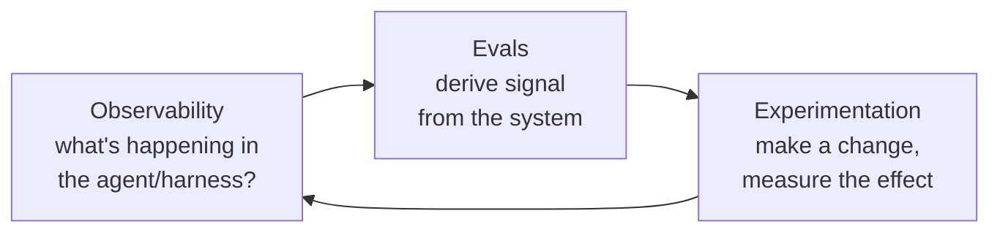

# LLM Observability, Evaluation, Experimentation (Dat Ngo, Arize)

A talk by Dat Ngo, AI architect at Arize AI, distilling what he sees across large
enterprises building AI systems. His framing: the AI space "feels like software
reimagined" — the same patterns in a different flavour. It feels like magic, but "it's
all just engineering." Everything reduces to a loop of three activities.

## The three activities

- **Observability** — answers *what is actually happening* inside the thing you built,
  whether that's an agent or a [harness](../harness-engineering/harness-engineering.md). You can't improve
  what you can't see. (See [agent observability](agent-observability.md).)
- **Evals** — how you *derive signal* from a non-deterministic system in some form or
  fashion. Without evals you're guessing whether a change helped.
- **Experimentation** — the catch. In a non-deterministic world, when you "fix" the
  thing you thought you fixed, you may have regressed something else. So a change isn't
  done when it looks fixed; it's done when you've *measured* that it improved the
  target without breaking a neighbour.

The key insight is that these three form a **cycle**, not a checklist: observe →
evaluate → experiment → observe again. Improvement in a non-deterministic system is
inseparable from measurement, because intuition ("this agent feels better") is not
evidence.

## Toward proactive observability

Ngo sketches where this is heading: an observability layer that doesn't just record
traces but *acts* on them — surfacing "high latency here," "errors detected there,"
and even proposing "you probably need a new eval for this." The tooling moves from
passive dashboards to an assistant that reasons over the system's own telemetry.

## Products mentioned

- **Arize Phoenix** — open source, single container, deployable locally with no
  Kubernetes; the engineering-first entry point.
- **Arize AX** — the enterprise offering (used by the likes of Uber, Booking, Reddit).

## Related

- [Agent Observability](agent-observability.md) — the sensing layer this talk centers on.
- [Evals & LLM-as-a-Judge](evals-llm-as-a-judge.md) — deriving signal from the system.
- [Harness Engineering](../harness-engineering/harness-engineering.md) — the "thing you built" being observed.

## References
- [LLM Observability, Evaluation, Experimentation Platform — Dat Ngo, Arize (AI Engineer)](https://www.youtube.com/watch?v=JsCCrBF7F1g)
