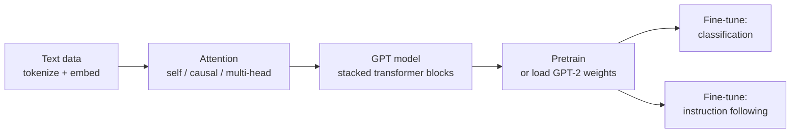

# Build a Large Language Model (From Scratch)

A hands-on book by Sebastian Raschka (Manning, 2024) that walks the reader through
coding a GPT-style large language model from the ground up in PyTorch — no high-level
LLM libraries, so that every mechanism is visible and understood rather than imported.
The premise is that the surest way to demystify the "AI black box" is to build a small
but complete one yourself: each stage is developed with plain-language explanations,
diagrams, and runnable code, and the model is deliberately kept small enough to train
on a laptop or a modest single GPU while remaining architecturally faithful to
production systems like GPT-2/GPT-3.

## Scope

The book takes a single narrative arc — **design → pretrain → load weights → fine-tune**
— and never breaks the "from scratch" contract. It is the model-building counterpart to
the systems-level treatments elsewhere in HAL: where
[ai-engineering-huyen.md](ai-engineering-huyen.md) and
[designing-machine-learning-systems.md](designing-machine-learning-systems.md) teach how
to *ship* models, this teaches how the model itself is *made*. It sits alongside
[build-and-fine-tune-small-language-model.md](build-and-fine-tune-small-language-model.md)
(a similar from-scratch GPT build) and complements the internals tour in
[under-the-hood-kumaresan.md](under-the-hood-kumaresan.md). The architecture it
constructs is the transformer described conceptually in
[../ai/transformers-and-attention.md](../ai/transformers-and-attention.md) and
[../ai/large-language-models.md](../ai/large-language-models.md), grounded in
[../ai/deep-learning.md](../ai/deep-learning.md) and trained by the machinery in
[../ai/backpropagation-and-gradient-descent.md](../ai/backpropagation-and-gradient-descent.md).

## What you build, stage by stage

- **Working with text data.** Turn raw text into model input: build a tokenizer, move to
  byte-pair encoding (BPE), create input–target pairs with a sliding window, and produce
  token embeddings plus positional embeddings.
- **Attention mechanisms.** Implement attention from first principles — a simplified
  self-attention, then scaled dot-product attention with trainable weights, then causal
  (masked) attention so a token can only see the past, and finally multi-head attention.
  This is the load-bearing chapter and the reason the rest of the model works.
- **The GPT model.** Assemble the transformer block — layer normalization, GELU
  activations, a feed-forward network, and residual/shortcut connections — and stack
  the blocks into a full GPT architecture that emits logits and generates text.
- **Pretraining on unlabeled data.** Compute the cross-entropy loss, run a training loop
  over a general text corpus, evaluate generation quality, and control decoding with
  temperature scaling and top-k sampling. Because pretraining from zero is expensive,
  the chapter also shows how to **load OpenAI's pretrained GPT-2 weights** into the
  hand-built model, giving a capable base to fine-tune.
- **Fine-tuning for classification.** Adapt the pretrained model to a supervised task
  (spam vs. not-spam) by replacing the output head and training on labeled data — the
  cheapest, most concrete form of task adaptation.
- **Fine-tuning to follow instructions.** Build an instruction dataset, format prompts,
  fine-tune the model to respond to instructions, and evaluate the instruction-following
  behavior — the step that turns a raw text predictor into an assistant.

## Why it matters

By the end the reader has a GPT they can point to line by line: they know where the
attention scores come from, why the causal mask exists, what the residual connections
buy, and how the same base model is specialized either by swapping a classification head
or by instruction tuning. That mechanical fluency is what makes later work on evaluation,
serving, and reasoning legible rather than magical — it is the foundation the companion
volume [build-a-reasoning-model-raschka.md](build-a-reasoning-model-raschka.md) builds on.

## References

- [Build a Large Language Model (From Scratch) — Manning](https://www.manning.com/books/build-a-large-language-model-from-scratch)
