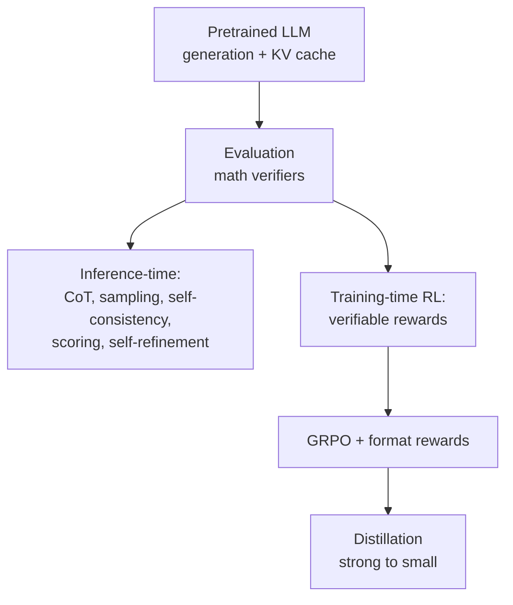

# Build a Reasoning Model (From Scratch)

A hands-on book by Sebastian Raschka (Manning) that does for reasoning-oriented LLMs
what its companion volume does for the base model: it implements the core methods from
scratch so the reader understands *how* a model comes to "reason" rather than treating
it as an opaque capability. The engineering story is deliberate and cumulative — start
from a conventional pretrained LLM, make its text generation and evaluation solid, then
improve reasoning first **without** touching the weights, and only then **by** changing
the weights through training. It presumes the reader can already build and run a
GPT-style model, so it pairs directly with
[build-a-large-language-model-raschka.md](build-a-large-language-model-raschka.md).

## Scope

Reasoning here means the model's ability to work through multi-step problems (math,
logic) and arrive at verifiably correct answers. The book organizes the terrain into
three moves: a solid **baseline**, **inference-time** improvements (cheap, no retraining),
and **training-time** improvements (reinforcement learning and distillation). This makes
it the applied bridge between the RL theory in
[../ai/reinforcement-learning.md](../ai/reinforcement-learning.md) and a working reasoning
system — the same transformer internals from
[../ai/transformers-and-attention.md](../ai/transformers-and-attention.md) and
[../ai/large-language-models.md](../ai/large-language-models.md), now driven toward
correct multi-step outputs. It complements the internals tour in
[under-the-hood-kumaresan.md](under-the-hood-kumaresan.md) and the production framing of
[ai-engineering-huyen.md](ai-engineering-huyen.md).

## What you build, stage by stage

- **Baseline and generation.** Start from a conventional pretrained LLM and get its text
  generation right, including **KV caching** for efficient decoding. Without a fast,
  correct generator none of the later methods are practical.
- **Reliable evaluation.** Build the measurement tools first — notably **math verifiers**
  that can check whether a produced answer is actually correct. Verifiable rewards are the
  hinge the whole book turns on: you cannot reward or select reasoning you cannot score.
- **Inference-time reasoning (no weight changes).** Improve answers by spending more
  compute at generation time rather than retraining — **chain-of-thought** prompting to
  make intermediate steps explicit, **sampling** multiple candidate solutions,
  **self-consistency** (majority vote over samples), **response scoring**, and
  **self-refinement** where the model critiques and revises its own answer. This is
  inference-time scaling: trade tokens/compute for accuracy on a fixed model.
- **Reinforcement learning with verifiable rewards.** Move to changing the model itself.
  Use the verifier as a reward signal (RLHF-style, but the reward comes from correctness
  rather than a human preference model) to train the model toward reasoning that checks
  out. This applies the policy-optimization ideas from
  [../ai/reinforcement-learning.md](../ai/reinforcement-learning.md) to language.
- **GRPO and reward shaping.** Implement Group Relative Policy Optimization-style
  improvements to the RL loop and add **format rewards** so the model learns to structure
  its reasoning (e.g., emit its thinking and its final answer in a parseable form).
- **Distillation.** Finally, distill the reasoning ability of a stronger model into a
  smaller one — transferring hard-won capability into a cheaper package to run.

## Why it matters

The book's throughline is that reasoning is not a single trick but a ladder: verify
before you optimize, exhaust the cheap inference-time gains before paying for training,
and only then invest in RL and distillation. Building each rung by hand — especially the
verifier and the GRPO loop — turns the current wave of "reasoning models" from a headline
into something the reader can reproduce and reason about.

## References

- [Build a Reasoning Model (From Scratch) — Manning](https://www.manning.com/books/build-a-reasoning-model-from-scratch)
