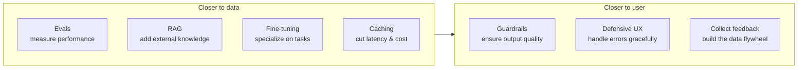

# Patterns for Building LLM-based Systems & Products

Eugene Yan distills the practitioner know-how for taking LLMs from demo to product into
**seven patterns**. His framing (quoting Karpathy): it's easy to demo a car driving
around the block; making it a product takes a decade. The patterns are arranged on two
axes — improving *performance* vs. reducing *cost/risk*, and closeness to the *data* vs.
closeness to the *user*.

## The seven patterns

- **Evals — to measure performance.** Without a representative eval set you're guessing;
  evals let you measure changes at scale and catch regressions across the whole system
  (model, prompt, retrieved context, temperature). This is the same conviction Hamel
  Husain builds a whole workflow around in
  [Your AI Product Needs Evals](your-ai-product-needs-evals.md).
- **RAG — to add knowledge.** Retrieve recent, external, or proprietary facts at query
  time instead of baking them into weights. Cheaper and more current than fine-tuning
  for factual freshness.
- **Fine-tuning — to specialize.** Best for teaching syntax, style, format, and rules —
  not facts (that's RAG's job).
- **Caching — to reduce latency and cost.** Store prior computations; a popularized
  approach keys cached responses on the embedding of the input so semantically similar
  requests get served instantly. Yan flags this as risky — cache *safely*, don't lean on
  semantic similarity alone.
- **Guardrails — to ensure output quality.** Enforce structure (valid JSON schema,
  executable code) for machine-readability, and add a safety layer (not harmful,
  factually accurate, coherent). Tools like Microsoft's Guidance act as a DSL that
  dictates output format token-by-token, guaranteeing valid syntax (plus "token
  healing" to avoid tokenization bugs). The CLI-level version of this is
  [`llm` schemas](simon-willison-llm.md).
- **Defensive UX — to handle errors gracefully.** Anticipate that the model will
  sometimes be wrong. Draws on Human-AI interaction guidelines from Microsoft (18
  guidelines), Google, and Apple — design for confidence display, attribution, stating
  limitations, and easy correction.
- **Collect user feedback — to build the data flywheel.** Make feedback effortless
  (thumbs up/down, regenerate). Capture **implicit** feedback too: Copilot-style accept/
  tweak/ignore signals, Midjourney's upscale-vs-variation actions, conversation length
  and stickiness. This feeds back into fine-tuning and eval sets.

## Why the framing helps

The value is the *spectrum*: data-side patterns (evals, RAG, fine-tuning, caching)
improve the engine; user-side patterns (guardrails, defensive UX, feedback) protect the
experience and close the loop back to data. Together they form the flywheel that turns a
fragile demo into a product that improves in production — the same loop
[observability-driven development](honeycomb-observability-for-llms.md) describes from
the operational side.

## Related

- [Your AI Product Needs Evals (Hamel Husain)](your-ai-product-needs-evals.md)
- [LLM-as-a-Judge: Complete Guide](llm-as-a-judge-complete-guide.md)
- [Honeycomb: observability for LLMs](honeycomb-observability-for-llms.md)

## References

- [Patterns for Building LLM-based Systems & Products — Eugene Yan](https://eugeneyan.com/writing/llm-patterns/)
