# Fixing SWE-bench: A Smarter Way to Evaluate Coding AI

Toloka audited [SWE-bench](swe-bench-leaderboard.md) and found the benchmark's low
scores may say as much about the *evaluation* as about the *models*. Their framing
question: "Are the models really that far from independently handling compound coding
tasks, or are the evaluation standards skewed?" The answer, in large part, was the
latter — and the fix is data cleanup, not model improvement.

## Where SWE-bench falls short

- **Unfit tests.** Some hidden tests are irrelevant or overly specific, producing
  **false negatives** — a correct fix gets rejected because it varies slightly from
  the reference solution.
- **Vague or ambiguous problem descriptions.** Many issue texts don't clearly state
  what needs solving, so models misinterpret requirements and are marked wrong for
  answering a question the task never actually posed.
- **Inconsistent environments.** A patch that works in one setup fails in another due
  to dependency, config, or system differences — the failure is environmental, not the
  model's fault.
- **Outdated dataset.** The newest pull request dates to 2023 — ancient for Python.
  Stale tasks don't reflect current practices and are exposed to **training-data
  contamination** (the model may have seen the fix).
- **No automated environment replication.** You can't run SWE-bench without manually
  standing up each repo's environment first — research puts this at ~10 hours per
  repository on average.

## Toloka's two-step cleanup

```mermaid
flowchart TD
    R[Raw SWE-bench samples] --> S1[Step 1: Rate quality]
    S1 --> C1[Clarity<br/>is the issue understandable?]
    S1 --> C2[Test relevance<br/>fair, not over/under-specific?]
    S1 --> C3[Difficulty<br/>15 min to 4+ hours]
    C1 & C2 & C3 --> D[Drop below-threshold samples]
    D --> S2[Step 2: Verify remainder]
    S2 --> V1[Build Dockerfile per issue]
    V1 --> V2[Apply solution patch]
    V2 --> V3{Run tests}
    V3 -->|FAIL_TO_PASS +<br/>PASS_TO_PASS both pass| K[Keep — high quality]
    V3 -->|fails| D
```

**Step 1 — rate quality.** Coding-expert annotators score each sample on **clarity**,
**test relevance**, and **difficulty**, then drop anything below a quality threshold
and flag false negatives caused by test misalignment or unclear descriptions.

**Step 2 — verify the survivors.** Annotators build a Dockerfile per issue, apply the
known-good solution patch, and confirm it works — eliminating setup-error failures. A
sample is kept only if it passes both:

- **FAIL_TO_PASS** — fails before the fix, passes after (confirms the fix resolves the issue).
- **PASS_TO_PASS** — passes before and after (confirms the fix introduces no regressions).

The result is a dataset where a rejected patch is genuinely wrong, not a victim of a
bad test or a broken environment.

## Takeaway

This audit is the concrete evidence behind the "benchmarks rot and leak" warning: a
public number can be depressed (or inflated) by dataset flaws that have nothing to do
with model capability. It's why you use benchmarks as a coarse filter and validate on
your own [evals](evals-llm-as-a-judge.md).

## Related

- [Public Benchmarks](public-benchmarks.md) — cites this audit as the "rot and leak" example.
- [SWE-bench Leaderboard](swe-bench-leaderboard.md) — the benchmark being audited.
- [Evals & LLM-as-a-Judge](evals-llm-as-a-judge.md) — why your own evals beat a public score.

## References
- [Fixing SWE-bench: a smarter way to evaluate coding AI — Toloka](https://toloka.ai/blog/fixing-swe-bench-a-smarter-way-to-evaluate-coding-ai/)
