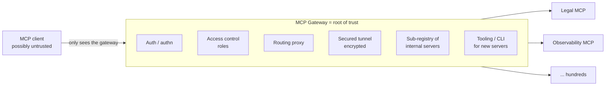

# Gateways Are All You Need (MCP in the Enterprise)

A talk by **Karan Sampath** (forward-deployed engineer, Anthropic) at the AI
Engineer conference, arguing that **MCP gateways** are the missing infrastructure
that lets enterprises actually use the Model Context Protocol at scale. Where
[LiteLLM](litellm.md) is a gateway in front of *models*, this is a gateway in
front of *tools/MCP servers* — the same architectural move applied one layer up.

## The problem: a three-headed hydra

The public MCP registry has thousands of servers and grows fast, but a registry
alone is **incomplete for an enterprise**. Three table-stakes concerns the
protocol allows for but the community hasn't built well:

- **Observability** — who is using which tools, and which tools are failing? Today
  this is largely opaque.
- **Access control** — ensuring the right users/groups reach the right servers and
  tools (e.g. everyone can *view* the observability MCP, only some can *change*
  dashboards).
- **Security** — verifying a server is safe against data exfiltration, and letting
  untrusted remote clients touch private enterprise data safely.

The result is a bottleneck: every team can now *build* MCP servers with coding
agents, but can't get them *deployed* — security teams are overloaded and blind,
and leadership wonders why the agents underperform. Left unsolved, enterprises
stay stuck on a handful of MCP tools, which fundamentally caps the protocol.

## The solution: bless one platform (a root of trust)

The core intuition — the *one takeaway* — is that a security team should **bless
a single platform** as the root of trust. A **gateway** is the concrete form: a
middle layer between any MCP client and the (potentially hundreds of) MCP servers.

Because the gateway handles auth, access control, routing, secure tunnels, and
hosting, **a new server only has to care about its business logic.** The legal
team can build and iterate on a contracts-review MCP without a technical team and
without repeated security reviews — the gateway already enforces the enterprise's
standards.

## Free lunches once a gateway exists

- **Surface invariance** — one integration reaches Claude.ai, Claude Code, and the
  Agent SDK; you don't reconfigure 40 servers per surface.
- **Secured connections** — encrypted client↔server links with a real root of
  trust, so sensitive data isn't exfiltrated.
- **Faster iteration** — decentralized teams change their own MCPs rapidly.
- **Standard primitives** — the gateway *encodes* the enterprise's standard
  operating procedures (which tools are expected, which are forbidden).
- **Pluggable credentials** — swap company-wide / team / service-account auth in
  and out per server.
- **Scalability** — one intelligent request-router fans tens of servers out to
  hundreds of thousands of agents.

## The bigger picture: decouple the harness from the data

Sampath's closing vision: **separate the agent harness from where your data
lives.** With an explosion of agent surfaces coming, agents shouldn't be tightly
coupled to how MCPs and data are structured — the gateway stays constant while
you freely choose which agents live in-house vs. outside. This is the same
harness-vs-model decoupling advocated in
[Harness Engineering (Sensors & Simulators)](../harness-engineering/harness-engineering.md), and it
depends on the *delegated identity* for agents that Sampath expects to matter in
the coming year.

**Three takeaways:** invest in common infra (don't roll your own MCPs, but let
teams build their own); use gateways for secured connections and a root of trust;
move toward separating the agent harness from the data layer.

## References
- [Gateways Are All You Need — Karan Sampath, Anthropic (AI Engineer)](https://www.youtube.com/watch?v=CD6R4Wf3jnY)
